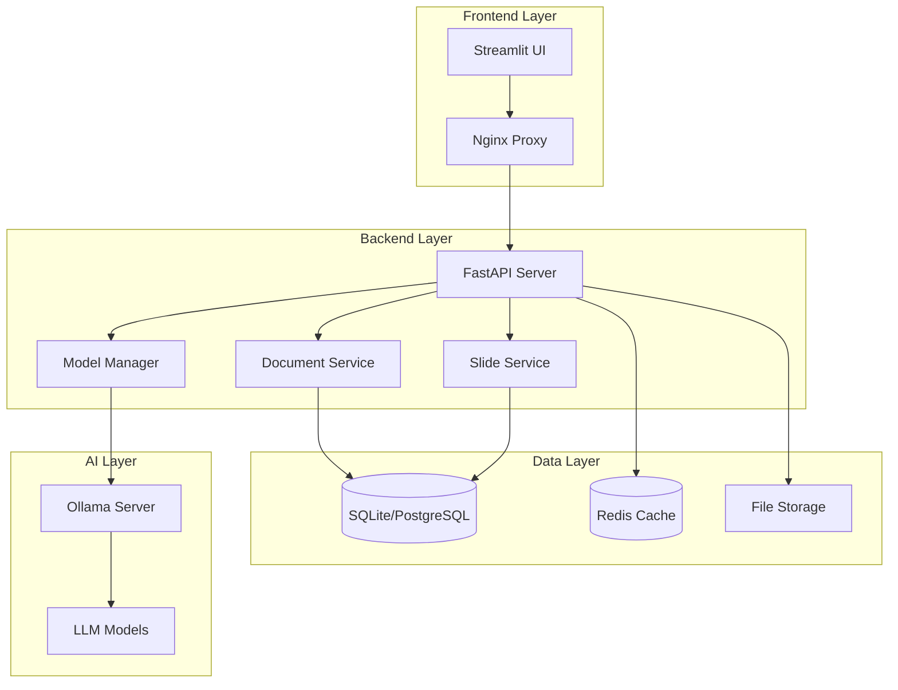

# AI NVCB - Advanced Document Analysis & Slide Generation

[](https://github.com/your-username/AI_NVCB/actions/workflows/ci.yml)
[](https://www.python.org)
[](https://fastapi.tiangolo.com)
[](https://streamlit.io)
[](https://docker.com)

An enterprise-grade AI-powered application that combines intelligent document analysis with automated presentation generation, featuring a modern CI/CD pipeline and production-ready deployment capabilities.

## 🚀 Features

### 📄 Document Analysis
- **Multi-format Support**: PDF, DOCX, TXT, MD processing
- **AI-Powered Analysis**: LLM-powered document summarization and insights
- **Interactive Q&A**: Real-time question answering on documents
- **Content Extraction**: Intelligent text extraction with metadata
- **Chat History**: Persistent conversation tracking

### 🎯 Presentation Generation
- **Automated Slides**: Generate presentations from document content
- **Customizable Templates**: Multiple presentation templates
- **Smart Formatting**: AI-optimized slide layouts and content
- **Export Options**: Multiple output formats (PPTX, PDF)

### 🔧 Model Management
- **Hot-Swappable Models**: Dynamic model switching without restart
- **Ollama Integration**: Seamless local LLM management
- **System Prompts**: Customizable AI behavior and responses
- **Performance Monitoring**: Model performance tracking

### 🛠️ DevOps & Production Features
- **CI/CD Pipeline**: Automated testing, building, and deployment
- **Health Monitoring**: Comprehensive health checks and alerting
- **Docker Support**: Full containerization with multi-stage builds
- **Load Balancing**: Nginx reverse proxy with WebSocket support
- **Security**: Pre-commit hooks, vulnerability scanning, code quality checks

## 📊 Architecture



## 💻 System Requirements

| Component | Minimum | Recommended |
|-----------|---------|-------------|
| **OS** | Windows 10, macOS 10.15, Ubuntu 20.04 | Windows 11, macOS 12+, Ubuntu 22.04+ |
| **CPU** | 4 cores | 8+ cores |
| **RAM** | 8GB | 16GB+ |
| **GPU** | None (CPU inference) | NVIDIA GPU with CUDA (faster inference) |
| **Storage** | 20GB free | 50GB+ SSD |
| **Network** | Stable connection | High-speed for model downloads |

## 🛠️ Prerequisites

Before installation, ensure you have:

- **Python 3.8+** ([Download](https://www.python.org/downloads/))
- **Poetry** ([Installation Guide](https://python-poetry.org/docs/#installation))
- **Ollama** ([Download](https://ollama.ai/download))
- **Git** ([Download](https://git-scm.com/downloads))
- **Docker** (Optional, [Download](https://docker.com/get-started))

## 📦 Installation

### Quick Start (Development)

```bash
# Clone the repository
git clone https://github.com/your-username/AI_NVCB.git
cd AI_NVCB

# Install dependencies with Poetry
poetry install

# Set up environment
cp .env.example .env
# Edit .env with your configuration

# Install pre-commit hooks
poetry run pre-commit install

# Start Ollama (in separate terminal)
ollama serve

# Pull required models
ollama pull qwen3:8b

# Run the application
poetry run python run_backend.py
poetry run python run_frontend.py
```

### Production Deployment (Docker)

```bash
# Clone and configure
git clone https://github.com/your-username/AI_NVCB.git
cd AI_NVCB
cp .env.example .env.production
# Configure production settings in .env.production

# Deploy with Docker Compose
docker-compose -f docker-compose.prod.yml up -d

# Check deployment status
docker-compose -f docker-compose.prod.yml ps
```

## 🚀 Quick Start Guide

### 1. Environment Setup

The application supports multiple environment configurations for development, testing, and production:

```bash
# Copy environment template
cp .env.example .env

# For development, also use the development overrides
cp .env.development .env.local

# Key configurations to update in .env:
# ENVIRONMENT=development
# OLLAMA_BASE_URL=http://localhost:11434
# MODEL_NAME=qwen3:8b
# DATABASE_URL=sqlite:///./ai_nvcb.db
# SECRET_KEY=generate_a_secure_key_here
# ADMIN_PASSWORD=secure_admin_password
```

### 2. Database Setup

Initialize the database with migrations and optional test data:

```bash
# Initialize database with migrations
poetry run python -c "from migrations.database_migrator import DatabaseMigrator; import asyncio; asyncio.run(DatabaseMigrator().run_migrations())"

# Seed database with test data (optional)
poetry run python -c "from migrations.database_seeder import DatabaseSeeder; import asyncio; asyncio.run(DatabaseSeeder().seed_all())"

# Check database status
poetry run python -c "from migrations.database_migrator import DatabaseMigrator; import asyncio; print(asyncio.run(DatabaseMigrator().get_migration_stats()))"
```

### 3. Start Services

#### Development Mode
```bash
# Start backend with auto-reload
poetry run python run_backend.py --reload

# Start frontend in development mode (new terminal)
poetry run streamlit run frontend/main.py --server.runOnSave true

# Monitor application health (new terminal)
poetry run python -c "from utils.health_check import monitor_health; import asyncio; asyncio.run(monitor_health())"
```

#### Production Mode with Docker
```bash
# Deploy full production stack
docker-compose -f docker-compose.prod.yml up -d

# Check deployment status
docker-compose -f docker-compose.prod.yml ps

# View logs
docker-compose -f docker-compose.prod.yml logs -f

# Check health
curl http://localhost/api/health
curl http://localhost/api/health/detailed
```

#### Kubernetes Deployment
```bash
# Deploy to Kubernetes
kubectl apply -f k8s/ai-nvcb-deployment.yaml

# Check deployment status
kubectl get pods -l app=ai-nvcb
kubectl get services -l app=ai-nvcb

# Check health
kubectl port-forward service/ai-nvcb-backend 8000:8000
curl http://localhost:8000/api/health
```

### 4. SSL/TLS Setup (Production)

For production deployments, configure SSL certificates:

```bash
# Generate self-signed certificates for testing
poetry run python -c "from utils.ssl_manager import SSLManager; SSLManager().generate_self_signed_cert()"

# Or configure Let's Encrypt (requires domain)
poetry run python -c "from utils.ssl_manager import SSLManager; SSLManager().setup_letsencrypt('yourdomain.com')"

# Check certificate status
poetry run python -c "from utils.ssl_manager import SSLManager; print(SSLManager().get_certificate_info())"
```

### 5. First Use

1. **Access Application**: 
   - Development: http://localhost:8501
   - Production: https://yourdomain.com

2. **Admin Setup**: 
   - Visit `/admin` to configure initial settings
   - Default credentials: admin / (your ADMIN_PASSWORD from .env)

3. **Upload Document**: 
   - Use the document analysis page
   - Supported formats: PDF, DOCX, TXT, MD
   - Maximum file size: 10MB (configurable)

4. **Ask Questions**: 
   - Try the interactive Q&A feature
   - Chat history is automatically saved

5. **Generate Slides**: 
   - Create presentations from your content
   - Multiple templates available
   - Export as PPTX or PDF

6. **Manage Models**: 
   - Switch between different AI models via the UI
   - Pull new models from Ollama registry
   - Monitor model performance and usage

## 🔧 Configuration

### Environment Variables Reference

The application uses comprehensive environment-based configuration across multiple files:

#### Configuration Files
- `.env.example` - Complete configuration template with all options
- `.env.development` - Development environment overrides
- `.env.production` - Production environment settings (create from .env.example)
- `.env.testing` - Testing configuration (auto-created during tests)

#### Core Application Settings
```env
# Application Environment
ENVIRONMENT=development                    # development|production|testing
DEBUG=true                                # Enable debug mode
LOG_LEVEL=info                            # debug|info|warning|error|critical

# Server Configuration
BACKEND_HOST=0.0.0.0                      # Backend server host
BACKEND_PORT=8000                         # Backend server port
FRONTEND_HOST=0.0.0.0                     # Frontend server host
FRONTEND_PORT=8501                        # Frontend server port
BACKEND_URL=http://localhost:8000         # Backend URL for frontend
FRONTEND_URL=http://localhost:8501        # Frontend URL for backend
```

#### AI and Model Configuration
```env
# Ollama Configuration
OLLAMA_BASE_URL=http://localhost:11434    # Ollama server URL
MODEL_NAME=qwen3:8b                    # Default model to use
OLLAMA_TEMPERATURE=0.7                    # Model temperature (0.0-2.0)
OLLAMA_TOP_P=0.9                          # Top-p sampling (0.0-1.0)
OLLAMA_TOP_K=40                           # Top-k sampling
OLLAMA_MAX_TOKENS=2048                    # Maximum tokens per response
OLLAMA_TIMEOUT=300                        # Request timeout in seconds
OLLAMA_RETRY_ATTEMPTS=3                   # Number of retry attempts
OLLAMA_RETRY_DELAY=1                      # Delay between retries (seconds)

# Model Management
MODEL_CACHE_SIZE=5                        # Number of models to cache
MODEL_AUTO_PULL=true                      # Auto-pull missing models
MODEL_VALIDATION_ENABLED=true             # Validate model responses
```

#### Database Configuration
```env
# Database Settings
DATABASE_URL=sqlite:///./ai_nvcb.db       # Database connection URL
DATABASE_POOL_SIZE=20                     # Connection pool size
DATABASE_MAX_OVERFLOW=30                  # Max overflow connections
DATABASE_POOL_TIMEOUT=30                  # Pool checkout timeout
DATABASE_POOL_RECYCLE=3600               # Connection recycle time
DATABASE_ECHO=false                       # Log SQL queries
DATABASE_BACKUP_ENABLED=true             # Enable automatic backups
DATABASE_BACKUP_RETENTION_DAYS=30        # Backup retention period
```

#### Security Configuration
```env
# Authentication & Authorization
SECRET_KEY=your_secret_key_here           # JWT secret key (must be secure!)
ADMIN_USERNAME=admin                      # Admin username
ADMIN_PASSWORD=secure_admin_password      # Admin password (must be secure!)
JWT_EXPIRATION_HOURS=24                   # JWT token expiration
PASSWORD_SALT_ROUNDS=12                   # Password hashing rounds

# CORS Settings
CORS_ORIGINS=["http://localhost:8501"]    # Allowed origins (JSON array)
CORS_ALLOW_CREDENTIALS=true               # Allow credentials
CORS_ALLOW_METHODS=["GET","POST","PUT","DELETE"] # Allowed methods
CORS_ALLOW_HEADERS=["*"]                  # Allowed headers
CORS_MAX_AGE=3600                         # Preflight cache time

# Security Features
SECURITY_HEADERS_ENABLED=true             # Enable security headers
XSS_PROTECTION_ENABLED=true              # Enable XSS protection
CSRF_PROTECTION_ENABLED=true             # Enable CSRF protection
CONTENT_TYPE_VALIDATION=true              # Validate content types
```

#### File Upload & Storage
```env
# File Upload Configuration
UPLOAD_FOLDER=./uploads                   # Upload directory
UPLOAD_MAX_SIZE=10485760                  # Max file size (10MB)
UPLOAD_ALLOWED_EXTENSIONS=[".txt",".pdf",".docx",".md"] # Allowed file types
UPLOAD_VIRUS_SCAN_ENABLED=false          # Enable virus scanning
UPLOAD_QUARANTINE_FOLDER=./quarantine    # Quarantine folder

# File Storage
STORAGE_TYPE=local                        # local|s3|azure|gcp
STORAGE_ENCRYPTION_ENABLED=false         # Encrypt stored files
STORAGE_COMPRESSION_ENABLED=true         # Compress stored files
FILE_RETENTION_DAYS=30                    # File retention period
```

#### Performance & Caching
```env
# Redis Configuration
REDIS_URL=redis://localhost:6379/0       # Redis connection URL
REDIS_PASSWORD=                           # Redis password (if required)
REDIS_MAX_CONNECTIONS=20                  # Max Redis connections
REDIS_SOCKET_TIMEOUT=5                    # Socket timeout
REDIS_SOCKET_CONNECT_TIMEOUT=5           # Connection timeout
REDIS_HEALTH_CHECK_INTERVAL=30           # Health check interval

# Caching Settings
CACHE_ENABLED=true                        # Enable caching
CACHE_TTL=3600                           # Default TTL (seconds)
CACHE_MAX_SIZE=1000                      # Max cache entries
CACHE_STRATEGY=lru                       # Cache eviction strategy
SESSION_CACHE_TTL=1800                   # Session cache TTL
```

#### Rate Limiting & Performance
```env
# Rate Limiting
RATE_LIMIT_ENABLED=true                   # Enable rate limiting
RATE_LIMIT_REQUESTS=100                   # Requests per window
RATE_LIMIT_WINDOW=60                      # Time window (seconds)
RATE_LIMIT_STORAGE=redis                  # Storage backend
RATE_LIMIT_STRATEGY=sliding_window        # Limiting strategy

# Performance Settings
WORKER_CONCURRENCY=4                      # Worker process count
ASYNC_POOL_SIZE=10                        # Async thread pool size
REQUEST_TIMEOUT=30                        # Request timeout
MAX_REQUEST_SIZE=50MB                     # Maximum request size
COMPRESSION_ENABLED=true                  # Enable response compression
```

#### Monitoring & Logging
```env
# Logging Configuration
LOG_FORMAT=json                           # json|text
LOG_FILE=logs/ai_nvcb.log                # Log file path
LOG_MAX_SIZE=10MB                        # Max log file size
LOG_BACKUP_COUNT=5                       # Number of backup files
LOG_COMPRESSION=true                     # Compress rotated logs

# Monitoring Settings
MONITORING_ENABLED=true                   # Enable monitoring
HEALTH_CHECK_INTERVAL=30                 # Health check interval
METRICS_ENABLED=true                     # Enable metrics collection
METRICS_PORT=9090                        # Metrics server port
PROMETHEUS_ENABLED=false                 # Enable Prometheus integration
ELASTICSEARCH_ENABLED=false              # Enable Elasticsearch logging
```

#### Development & Testing
```env
# Development Settings
HOT_RELOAD=true                          # Enable hot reload
DEBUG_TOOLBAR=true                       # Enable debug toolbar
PROFILING_ENABLED=false                  # Enable performance profiling
MOCK_EXTERNAL_SERVICES=false             # Mock external dependencies

# Testing Configuration
TEST_DATABASE_URL=sqlite:///./test.db    # Test database URL
TEST_REDIS_URL=redis://localhost:6379/1 # Test Redis URL
TEST_UPLOAD_FOLDER=./test_uploads        # Test upload folder
PYTEST_WORKERS=auto                      # Number of test workers
TEST_COVERAGE_THRESHOLD=80               # Coverage threshold
```

### Configuration Validation

The application automatically validates configuration on startup:

```bash
# Validate current configuration
poetry run python -c "from utils.config import validate_config; validate_config()"

# Show current configuration (sensitive values hidden)
poetry run python -c "from utils.config import show_config; show_config()"

# Test specific configuration sections
poetry run python -c "from utils.config import test_database_config; test_database_config()"
poetry run python -c "from utils.config import test_ollama_config; test_ollama_config()"
poetry run python -c "from utils.config import test_redis_config; test_redis_config()"
```

## 🧪 Testing

### Running Tests

```bash
# Run all tests
poetry run pytest

# Run specific test categories
poetry run pytest -m "unit"           # Unit tests only
poetry run pytest -m "integration"    # Integration tests only
poetry run pytest -m "not slow"       # Skip slow tests

# Run with coverage
poetry run pytest --cov=. --cov-report=html

# Test specific components
poetry run pytest tests/test_backend.py
poetry run pytest tests/test_integration.py
```

### Test Categories

- **Unit Tests**: Individual component testing
- **Integration Tests**: Component interaction testing
- **E2E Tests**: Full workflow testing
- **Performance Tests**: Load and stress testing

### Continuous Integration

The project includes automated CI/CD with:

- **Code Quality**: Black, isort, flake8, mypy
- **Security**: Bandit, safety checks
- **Testing**: Comprehensive test suite
- **Build**: Docker image creation
- **Deploy**: Automated deployment pipeline

## 🐳 Docker Deployment

### Development Environment

```bash
# Start development stack
docker-compose up -d

# View logs
docker-compose logs -f

# Stop services
docker-compose down
```

### Production Environment

```bash
# Production deployment
docker-compose -f docker-compose.prod.yml up -d

# Scale services
docker-compose -f docker-compose.prod.yml up -d --scale backend=3

# Update deployment
docker-compose -f docker-compose.prod.yml pull
docker-compose -f docker-compose.prod.yml up -d
```

### Docker Services

| Service | Description | Port |
|---------|-------------|------|
| `backend` | FastAPI server | 8000 |
| `frontend` | Streamlit app | 8501 |
| `nginx` | Reverse proxy | 80, 443 |
| `redis` | Cache & sessions | 6379 |

## 📊 Monitoring & Health Checks

### Health Endpoints

- `GET /api/health` - Basic health check
- `GET /api/health/detailed` - Comprehensive health status
- `GET /api/ready` - Kubernetes readiness probe
- `GET /api/live` - Kubernetes liveness probe

### Monitoring Script

```bash
# Start monitoring
poetry run python monitor.py

# Run single check
poetry run python monitor.py --once

# Custom monitoring
poetry run python monitor.py --interval 30 --backend-url http://localhost:8000
```

### Metrics & Alerts

The monitoring system tracks:

- **Application Health**: API responsiveness, error rates
- **System Resources**: CPU, memory, disk usage
- **Dependencies**: Ollama, Redis, database connectivity
- **Performance**: Response times, throughput

## 🔒 Security

### Security Features

- **Input Validation**: Comprehensive request validation
- **CORS Protection**: Configurable cross-origin settings
- **Rate Limiting**: Prevent abuse and DoS attacks
- **File Upload Security**: Type validation and size limits
- **Dependency Scanning**: Automated vulnerability checks

### Security Configuration

```env
# Authentication
ADMIN_USERNAME=admin
ADMIN_PASSWORD=secure_password_here

# CORS Settings
CORS_ORIGINS=https://yourdomain.com
CORS_ALLOW_CREDENTIALS=true

# File Upload Limits
UPLOAD_MAX_SIZE=10485760  # 10MB
UPLOAD_ALLOWED_EXTENSIONS=.txt,.pdf,.docx,.md
```

## 🚀 Production Deployment

### Manual Deployment

```bash
# Production deployment script
./deploy.sh production

# Or on Windows
deploy.bat production
```

### Automated Deployment (CI/CD)

The GitHub Actions pipeline automatically:

1. **Tests** code quality and functionality
2. **Builds** Docker images
3. **Scans** for security vulnerabilities
4. **Deploys** to staging/production environments

### Deployment Checklist

- [ ] Environment variables configured
- [ ] SSL certificates installed
- [ ] Database migrations applied
- [ ] Ollama models pulled
- [ ] Health checks passing
- [ ] Monitoring configured
- [ ] Backup strategy implemented

## 🛠️ Development

### Development Workflow

```bash
# Setup development environment
poetry install
poetry run pre-commit install

# Start development servers
poetry run python run_backend.py --reload
poetry run python run_frontend.py

# Code quality checks
poetry run black .
poetry run isort .
poetry run flake8 .
poetry run mypy .

# Run tests
poetry run pytest
```

### Code Quality Standards

The project enforces:

- **Code Formatting**: Black, isort
- **Linting**: flake8, pylint
- **Type Checking**: mypy
- **Security**: bandit
- **Documentation**: Docstring coverage

### Contributing

1. Fork the repository
2. Create a feature branch (`git checkout -b feature/amazing-feature`)
3. Make changes following code standards
4. Run tests (`poetry run pytest`)
5. Commit changes (`git commit -m 'Add amazing feature'`)
6. Push to branch (`git push origin feature/amazing-feature`)
7. Open a Pull Request

## 📚 API Documentation

### Core Endpoints

#### Document Analysis
```http
POST /api/documents/analyze
Content-Type: multipart/form-data

{
  "files": [file],
  "query_type": "summary|qa",
  "user_query": "Your question here"
}
```

#### Slide Generation
```http
POST /api/slides/generate
Content-Type: application/json

{
  "content": "Slide content here",
  "template": "default",
  "title": "Presentation Title"
}
```

#### Model Management
```http
GET /api/ollama/models        # List available models
POST /api/ollama/pull         # Pull new model
DELETE /api/ollama/delete     # Remove model
```

### Interactive API Documentation

- **Swagger UI**: http://localhost:8000/docs
- **ReDoc**: http://localhost:8000/redoc
- **OpenAPI Schema**: http://localhost:8000/openapi.json

## 🔧 Troubleshooting

### Common Issues

#### Ollama Connection Failed
```bash
# Check if Ollama is running
ollama list

# Start Ollama service
ollama serve

# Check connectivity
curl http://localhost:11434/api/tags
```

#### Port Already in Use
```bash
# Find process using port
netstat -ano | findstr :8000  # Windows
lsof -i :8000                 # macOS/Linux

# Kill process or change port in .env
PORT=8001
```

#### Module Import Errors
```bash
# Reinstall dependencies
poetry install --no-cache

# Check Python path
poetry run python -c "import sys; print(sys.path)"
```

#### Database Issues
```bash
# Reset database
rm ai_nvcb.db
poetry run python -c "from utils.database import init_db; init_db()"
```

### Logs and Debugging

```bash
# View application logs
tail -f logs/ai_nvcb.log

# Enable debug mode
export LOG_LEVEL=debug
export DEBUG=true

# Check component status
poetry run python -c "from utils.health_check import get_health_status; import asyncio; print(asyncio.run(get_health_status()))"
```

## 📈 Performance Optimization

### Backend Optimization

- **Database**: Use connection pooling, query optimization
- **Caching**: Redis for frequent queries and session data
- **Load Balancing**: Multiple backend instances behind Nginx
- **Resource Limits**: Configure worker processes and memory limits

### Frontend Optimization

- **Caching**: Streamlit session state management
- **Lazy Loading**: Progressive content loading
- **Compression**: Enable gzip compression in Nginx
- **CDN**: Static asset delivery optimization

### Model Optimization

- **Model Selection**: Choose appropriate model size for use case
- **Quantization**: Use quantized models for faster inference
- **Batch Processing**: Process multiple requests together
- **GPU Acceleration**: Enable CUDA for faster inference

## 📄 License

This project is licensed under the MIT License - see the [LICENSE](LICENSE) file for details.

## 🤝 Support

### Getting Help

- **Documentation**: Comprehensive guides and API docs
- **Issues**: [GitHub Issues](https://github.com/your-username/AI_NVCB/issues)
- **Discussions**: [GitHub Discussions](https://github.com/your-username/AI_NVCB/discussions)

### Community

- **Contributing**: See [CONTRIBUTING.md](CONTRIBUTING.md)
- **Code of Conduct**: See [CODE_OF_CONDUCT.md](CODE_OF_CONDUCT.md)
- **Security**: See [SECURITY.md](SECURITY.md)

## 🎯 Roadmap

### Short Term (v2.1)
- [ ] Enhanced model management UI
- [ ] Advanced document preprocessing
- [ ] Improved slide templates
- [ ] Performance optimizations

### Medium Term (v2.5)
- [ ] Multi-user support with authentication
- [ ] Cloud deployment templates
- [ ] Advanced analytics dashboard
- [ ] API rate limiting and quotas

### Long Term (v3.0)
- [ ] Distributed processing support
- [ ] Advanced AI capabilities
- [ ] Enterprise integration features
- [ ] Mobile application support

---

## 📊 Project Status

- **Version**: 2.0.0
- **Status**: Production Ready
- **Last Updated**: May 26, 2025
- **Maintainer**: AI NVCB Development Team

Built with ❤️ using FastAPI, Streamlit, and modern DevOps practices.
   - Install system dependencies:
     - **Windows**: No additional steps needed
     - **macOS**: `brew install poppler`
     - **Linux**: `sudo apt-get install poppler-utils`

2. Clone the repository
   ```bash
   git clone https://github.com/Ninhhk/AI_NK.git
   cd AI_NK
   ```

3. Install Poetry (if not already installed):
   ```bash
   pip install poetry
   ```

4. Install dependencies:
   ```bash
   poetry install
   ```

5. Set up environment variables(if there is no .env file):
   Create a `.env` file with:
   ```
   MODEL_NAME=qwen3:8b
   OLLAMA_BASE_URL=http://localhost:11434
   ```

## Usage

1. Start Ollama server and ensure your model is available:
   ```bash
   ollama run qwen3:8b
   ```
   Wait for ollama to download the model(~5Gb). You can test prompt or press Ctrl+D to exit.

2. Start the backend and frontend (in separate terminals):
   ```bash
   # Terminal 1: Backend
   python run_backend.py

   # Terminal 2: Frontend
   python run_frontend.py
   ```

3. Access the application in your browser at http://localhost:8501

## Updating the Application

To update the application to the latest version, you can use our automated update scripts or follow the manual steps.

### Using the Update Scripts (Recommended)

We've created convenient scripts to automate the update process:

1. **On Windows**: Simply run the `update_project.bat` script
   ```cmd
   update_project.bat
   ```

2. **On macOS/Linux**: Make the shell script executable if needed, then run it
   ```bash
   chmod +x update_project.sh
   ./update_project.sh
   ```

These scripts will automatically:
- Pull the latest changes from git
- Update poetry dependencies
- Perform basic dependency tests

After the update completes, restart your servers:
```bash
# Terminal 1
python run_backend.py

# Terminal 2
python run_frontend.py
```

For more options and troubleshooting, see [README_UPDATE.md](README_UPDATE.md).

### Manual Update Steps

If you prefer to update manually, follow these steps:

1. Pull the latest changes from the repository:
   ```bash
   git stash
   git pull origin main
   ```

2. Update dependencies:
   ```bash
   poetry lock
   poetry install
   ```

3. Restart the backend server:
   ```bash
   python run_backend.py
   ```

4. Restart the frontend application:
   ```bash
   python run_frontend.py
   ```

## Development

- Use Poetry for dependency management
- Follow PEP 8 style guidelines
- Write tests for new features

## License

MIT License - See LICENSE file for details

## Vietnamese Translation / Bản dịch tiếng Việt

# AI-NVCB

Ứng dụng được hỗ trợ bởi AI kết hợp khả năng phân tích tài liệu và tạo bài thuyết trình.

## Tính năng

- Phân tích Tài liệu
  - Xử lý và phân tích tài liệu PDF
  - Tóm tắt tài liệu được hỗ trợ bởi LLM
  - Trả lời câu hỏi dựa trên tài liệu
  
- Tạo Bài Thuyết trình
  - Tự động tạo slide từ nội dung
  - Hỗ trợ nhiều định dạng đầu vào
  - Mẫu thuyết trình có thể tùy chỉnh

## Cấu trúc Dự án

```
AI_NVCB/
├── frontend/        # Ứng dụng frontend Streamlit và Flask
├── backend/         # Dịch vụ backend và API cốt lõi
├── utils/          # Tiện ích và hàm trợ giúp
├── data/           # Lưu trữ dữ liệu và tài nguyên
└── tests/          # Bộ kiểm thử
```

## Yêu cầu Hệ thống

- **Hệ điều hành**: Windows 10/11, macOS 10.15+, hoặc Linux (khuyến nghị Ubuntu 20.04+)
- **CPU**: Tối thiểu 4 lõi (khuyến nghị 8+ lõi để hiệu suất tốt hơn)
- **RAM**: Tối thiểu 8GB (khuyến nghị 16GB+)
- **GPU**: Tùy chọn nhưng được khuyến nghị để suy luận mô hình nhanh hơn (NVIDIA GPU hỗ trợ CUDA)
- **Dung lượng ổ đĩa**: Ít nhất 10GB không gian trống
- **Mạng**: Kết nối internet ổn định để tải mô hình

## Cài đặt

1. Cài đặt phần mềm tiên quyết:
   - Cài đặt [Python 3.8+](https://www.python.org/downloads/)
   - Cài đặt [Ollama](https://ollama.ai/download)
   - Cài đặt [Git](https://git-scm.com/downloads)

2. Sao chép kho lưu trữ
   ```bash
   git clone https://github.com/Ninhhk/AI_NK.git
   cd AI_NK
   ```

3. Cài đặt Poetry:
   ```bash
   pip install poetry
   ```

4. Cài đặt các phụ thuộc:
   ```bash
   poetry install
   ```

5. Cài đặt môi trường(nếu không có file .env ):
   Tạo file `.env` với nội dung:
   ```
   MODEL_NAME=qwen3:8b
   OLLAMA_BASE_URL=http://localhost:11434
   ```

## Sử dụng

1. Khởi động máy chủ Ollama và đảm bảo mô hình của bạn có sẵn:
   ```bash
   ollama run qwen3:8b
   ```
   Chờ Ollama tải xuống mô hình (~5Gb). Bạn có thể thử prompt hoặc nhấn Ctrl+D để thoát.

2. Khởi động backend và frontend (trong các terminal riêng biệt)(Ctrl+Shift+5 trong VSCode):
   ```bash
   # Terminal 1: Backend
   python run_backend.py

   # Terminal 2: Frontend
   python run_frontend.py
   ```

3. Truy cập ứng dụng tại http://localhost:8501


## Cập nhật ứng dụng

Để cập nhật ứng dụng lên phiên bản mới nhất, bạn có thể sử dụng các script cập nhật tự động hoặc thực hiện các bước thủ công.

### Sử dụng Script Cập nhật (Khuyến nghị)

Chúng tôi đã tạo các script tiện lợi để tự động hóa quá trình cập nhật:

1. **Trên Windows**: Chỉ cần chạy script `update_project.bat`
   ```cmd
   update_project.bat
   ```

2. **Trên macOS/Linux**: Làm cho script có quyền thực thi nếu cần, sau đó chạy nó
   ```bash
   chmod +x update_project.sh
   ./update_project.sh
   ```

Các script này sẽ tự động:
- Kéo các thay đổi mới nhất từ git
- Cập nhật các phụ thuộc poetry
- Thực hiện kiểm tra các phụ thuộc cơ bản

Sau khi cập nhật hoàn tất, khởi động lại các máy chủ:
```bash
# Terminal 1
python run_backend.py

# Terminal 2
python run_frontend.py
```

Để biết thêm tùy chọn và cách khắc phục sự cố, xem [README_UPDATE.md](README_UPDATE.md).

### Các Bước Cập nhật Thủ công

Nếu bạn thích cập nhật thủ công, hãy làm theo các bước sau:

1. Kéo các thay đổi mới nhất từ kho lưu trữ:
```bash
git stash
git pull origin main
```

2. Cập nhật các phụ thuộc:
```bash
poetry lock
poetry install
```

3. Khởi động lại máy chủ backend:
```bash
python run_backend.py
```

4. Khởi động lại ứng dụng frontend:
```bash
python run_frontend.py
```

## Phát triển

- Sử dụng Poetry để quản lý phụ thuộc
- Tuân theo các hướng dẫn phong cách PEP 8
- Viết kiểm thử cho các tính năng mới

## Giấy phép

Giấy phép MIT - Xem tệp LICENSE để biết chi tiết

## Advanced Usage

You can pass various flags to control the update process:

```
# Windows (Continue even if some steps fail)
update_project.bat --continue-on-error

# Linux/Mac (Continue even if some steps fail)
./update_project.sh --continue-on-error

# Skip stashing local changes (not recommended)
update_project.bat --skip-stash
./update_project.sh --skip-stash

# Only stash changes without updating (useful for quick context switching)
update_project.bat --stash-only
./update_project.sh --stash-only

# Don't restore stashed changes after updating
update_project.bat --no-restore
./update_project.sh --no-restore
```

### Git Stash Protection

The update scripts automatically handle local changes in your working directory:

1. **Auto-stashing**: Any local uncommitted changes are automatically stashed before pulling updates
2. **Conflict Detection**: After update, the script checks if restoring changes would cause conflicts
3. **Conflict Resolution Options**: If conflicts are detected, you'll be given options:
   - Apply stash anyway (might cause conflicts)
   - Keep changes stashed (with instructions to restore later)
   - Create a branch with your stashed changes (safest option)

This prevents the common issue of losing work or creating merge conflicts during updates.

## Sử Dụng Nâng Cao

Bạn có thể sử dụng các cờ sau để kiểm soát quá trình cập nhật:

```
# Windows (Tiếp tục ngay cả khi một số bước thất bại)
update_project.bat --continue-on-error

# Linux/Mac (Tiếp tục ngay cả khi một số bước thất bại)
./update_project.sh --continue-on-error

# Bỏ qua việc stash các thay đổi cục bộ (không khuyến khích)
update_project.bat --skip-stash
./update_project.sh --skip-stash

# Chỉ stash các thay đổi mà không cập nhật (hữu ích để chuyển ngữ cảnh nhanh)
update_project.bat --stash-only
./update_project.sh --stash-only

# Không khôi phục các thay đổi đã stash sau khi cập nhật
update_project.bat --no-restore
./update_project.sh --no-restore
```

### Bảo Vệ Git Stash

Các script cập nhật tự động xử lý các thay đổi cục bộ trong thư mục làm việc của bạn:

1. **Tự động stash**: Bất kỳ thay đổi nào chưa commit sẽ được tự động stash trước khi kéo cập nhật
2. **Phát hiện xung đột**: Sau khi cập nhật, script kiểm tra xem việc khôi phục thay đổi có gây xung đột không
3. **Tùy chọn giải quyết xung đột**: Nếu phát hiện xung đột, bạn sẽ được cung cấp các tùy chọn:
   - Áp dụng stash dù sao (có thể gây xung đột)
   - Giữ các thay đổi trong stash (với hướng dẫn để khôi phục sau)
   - Tạo một nhánh mới với các thay đổi đã stash (tùy chọn an toàn nhất)

Điều này ngăn chặn vấn đề phổ biến về mất công việc hoặc tạo xung đột hợp nhất trong quá trình cập nhật.
