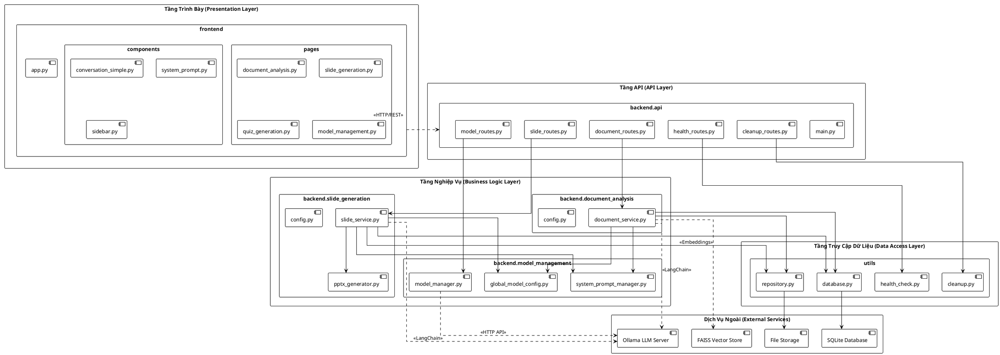
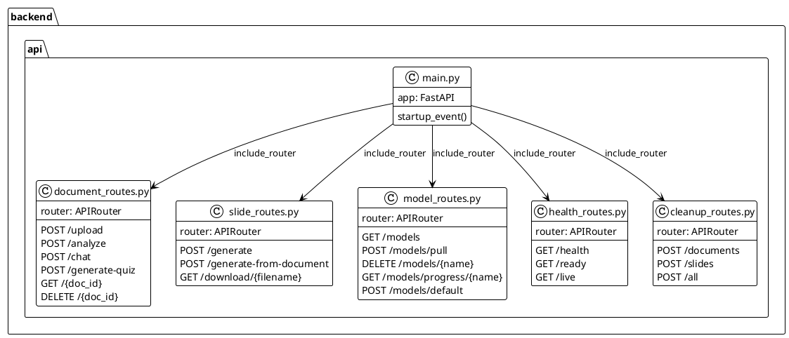
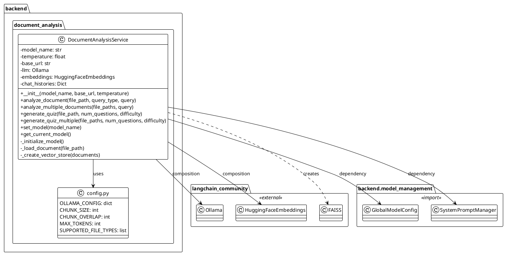
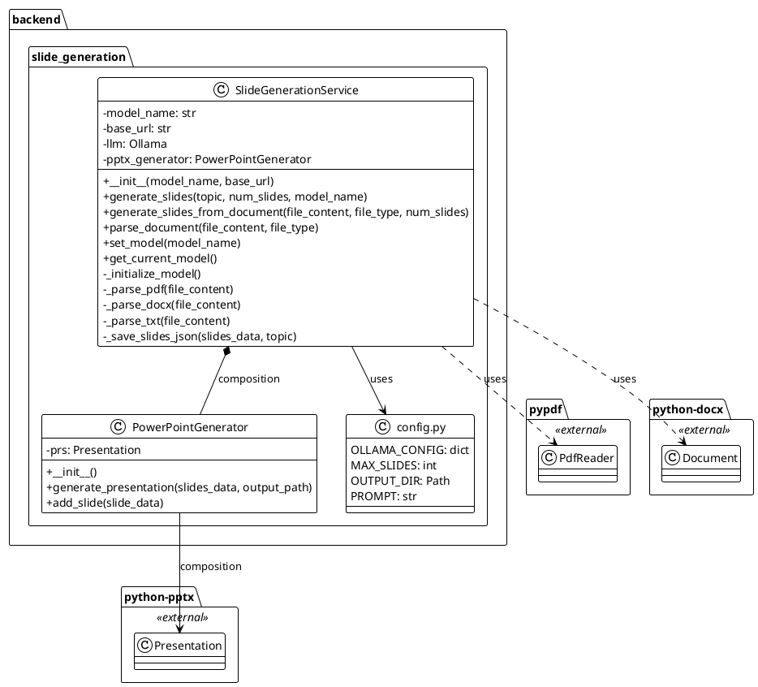
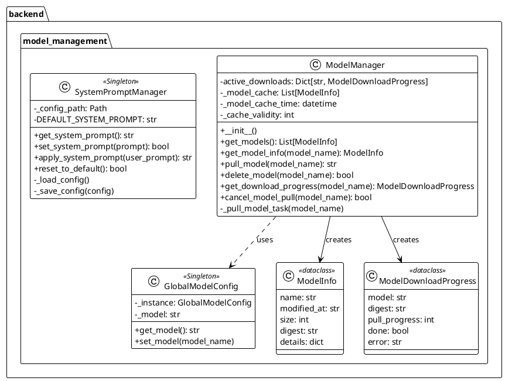
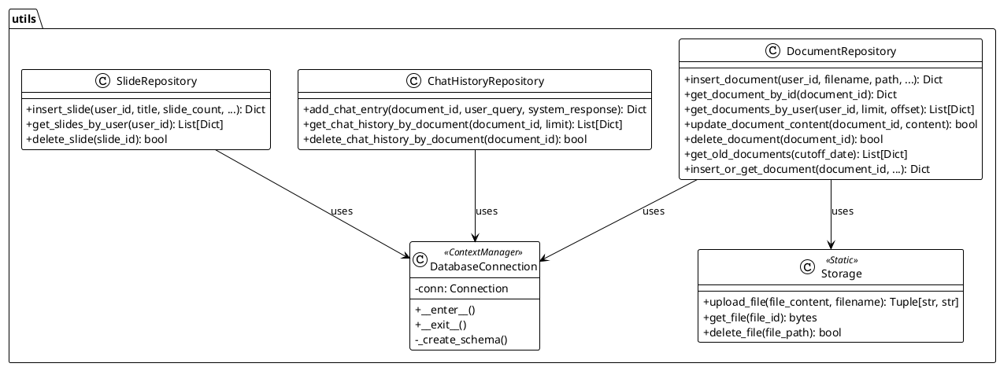
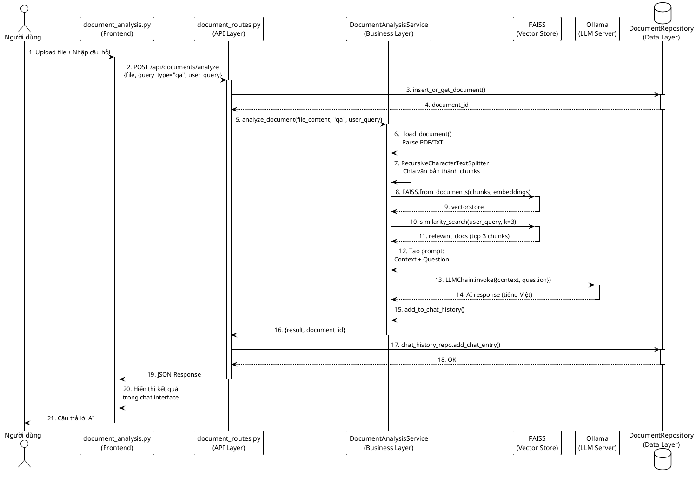
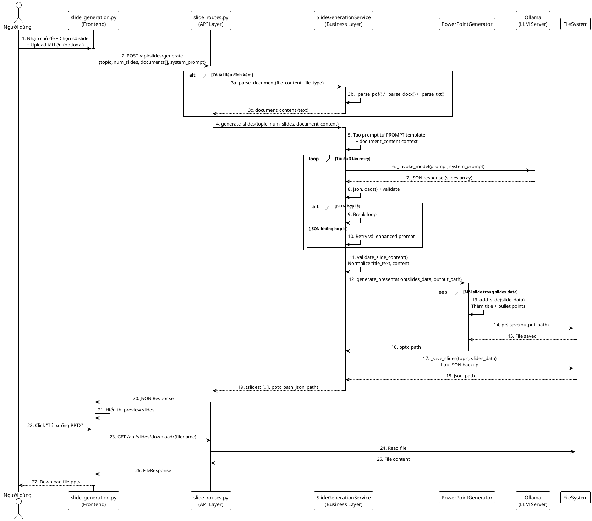
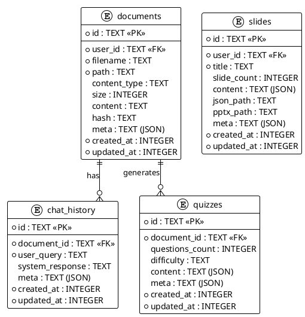
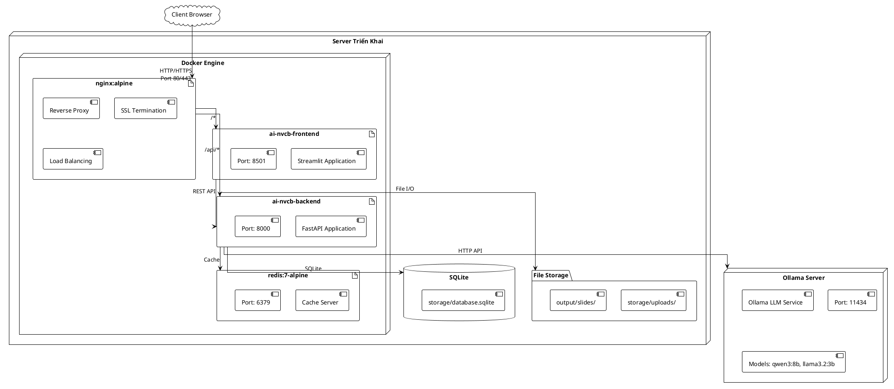

# CHƯƠNG 4: THIẾT KẾ, TRIỂN KHAI VÀ ĐÁNH GIÁ HỆ THỐNG

## Mở đầu chương

Chương này trình bày chi tiết quá trình thiết kế, triển khai và đánh giá hệ thống AI NVCB. Nội dung chương bao gồm: (1) Thiết kế kiến trúc phần mềm với biểu đồ gói UML, (2) Thiết kế chi tiết giao diện, lớp và cơ sở dữ liệu, (3) Xây dựng ứng dụng với các công cụ và thư viện cụ thể, (4) Kiểm thử hệ thống, và (5) Triển khai và đánh giá kết quả. Các thiết kế trong chương này được xây dựng dựa trên yêu cầu chức năng (UC01-UC04) và phi chức năng (NFR01-NFR21) đã xác định tại Chương 2, sử dụng các công nghệ đã lựa chọn tại Chương 3.

---

## 4.1 Thiết kế kiến trúc

### 4.1.1 Lựa chọn kiến trúc phần mềm

#### Kiến trúc phân lớp (Layered Architecture)

Hệ thống AI NVCB được xây dựng theo **kiến trúc phân lớp (Layered Architecture)** kết hợp với **mô hình Repository Pattern**. Đây là kiến trúc phổ biến trong các ứng dụng enterprise, phân tách hệ thống thành các tầng độc lập với trách nhiệm rõ ràng.

**Định nghĩa kiến trúc phân lớp:**

Kiến trúc phân lớp tổ chức hệ thống thành các tầng (layers) xếp chồng lên nhau, trong đó mỗi tầng chỉ giao tiếp với tầng liền kề. Nguyên tắc cơ bản là: (i) tầng trên phụ thuộc vào tầng dưới, (ii) tầng dưới không biết đến sự tồn tại của tầng trên, và (iii) không có phụ thuộc bỏ qua tầng (skip-layer dependency).

**Lý do lựa chọn:**

Thứ nhất, kiến trúc phân lớp đáp ứng yêu cầu NFR18 về tính dễ bảo trì đã nêu tại mục 2.4.5. Việc tách biệt các tầng cho phép thay đổi implementation ở một tầng mà không ảnh hưởng đến các tầng khác.

Thứ hai, kiến trúc này phù hợp với stack công nghệ đã chọn tại Chương 3: FastAPI (backend API), Streamlit (frontend), và LangChain/Ollama (AI services). Mỗi công nghệ được ánh xạ vào một tầng cụ thể.

Thứ ba, Repository Pattern được bổ sung để tách biệt logic truy cập dữ liệu, giúp dễ dàng thay đổi từ SQLite sang PostgreSQL hoặc database khác khi cần mở rộng quy mô.

#### Áp dụng kiến trúc vào hệ thống AI NVCB

Hệ thống AI NVCB được tổ chức thành **4 tầng chính**:

| Tầng | Tên gọi | Thành phần trong hệ thống | Trách nhiệm |
|------|---------|---------------------------|-------------|
| **Tầng 1** | Presentation Layer | `frontend/` (Streamlit) | Giao diện người dùng, xử lý input/output |
| **Tầng 2** | API Layer | `backend/api/` (FastAPI) | Định nghĩa REST API endpoints, validation |
| **Tầng 3** | Business Logic Layer | `backend/document_analysis/`, `backend/slide_generation/`, `backend/model_management/` | Xử lý nghiệp vụ chính: phân tích tài liệu, tạo slide, quản lý model |
| **Tầng 4** | Data Access Layer | `utils/repository.py`, `utils/database.py` | Truy cập CSDL, lưu trữ file |

**Thành phần bổ sung:**
- **External Services**: Ollama LLM Server, FAISS Vector Store - các dịch vụ bên ngoài mà hệ thống tích hợp
- **Utilities**: `utils/` - các module tiện ích dùng chung (logging, cleanup, health check)

#### So sánh với kiến trúc MVC truyền thống

| Thành phần MVC | Tương ứng trong AI NVCB | Mở rộng/Cải tiến |
|----------------|-------------------------|------------------|
| **Model** | `utils/repository.py` + Pydantic Models | Sử dụng Repository Pattern thay vì Active Record |
| **View** | `frontend/` (Streamlit pages) | Tách biệt hoàn toàn khỏi backend qua REST API |
| **Controller** | `backend/api/` (FastAPI routers) | Tách thành API Layer + Service Layer |

Điểm cải tiến so với MVC truyền thống là việc tách Controller thành hai phần: API Layer (chỉ xử lý HTTP request/response) và Service Layer (chứa business logic). Điều này tuân theo nguyên tắc Single Responsibility Principle (SRP).

---

### 4.1.2 Thiết kế tổng quan

#### Biểu đồ gói UML (Package Diagram)

Biểu đồ dưới đây thể hiện cấu trúc các gói trong hệ thống AI NVCB và mối quan hệ phụ thuộc giữa chúng. Các gói được sắp xếp theo tầng từ trên xuống dưới.



#### Mô tả chi tiết các gói

**Tầng Trình Bày (Presentation Layer):**

| Gói | Mô tả | Liên kết Use Case |
|-----|-------|-------------------|
| `frontend.pages` | Các trang giao diện chính của ứng dụng Streamlit | UC01-UC04 |
| `frontend.components` | Các component tái sử dụng (sidebar, chat, system prompt) | Hỗ trợ UC01.4 |
| `frontend.app` | Entry point của ứng dụng frontend | - |

**Tầng API (API Layer):**

| Gói | Mô tả | Endpoints chính |
|-----|-------|-----------------|
| `backend.api` | FastAPI routers định nghĩa REST API | `/api/documents/*`, `/api/slides/*`, `/api/ollama/*` |

Chi tiết các router:
- `document_routes.py`: Upload tài liệu, phân tích, Q&A, tạo quiz (UC01, UC03)
- `slide_routes.py`: Tạo slide từ chủ đề/tài liệu (UC02)
- `model_routes.py`: Quản lý model Ollama (UC04)
- `health_routes.py`: Health check endpoints (NFR06)
- `cleanup_routes.py`: Dọn dẹp storage (NFR09)

**Tầng Nghiệp Vụ (Business Logic Layer):**

| Gói | Mô tả | Lớp chính |
|-----|-------|-----------|
| `backend.document_analysis` | Xử lý phân tích tài liệu và RAG | `DocumentAnalysisService` |
| `backend.slide_generation` | Tạo nội dung slide và file PPTX | `SlideGenerationService`, `PowerPointGenerator` |
| `backend.model_management` | Quản lý model LLM và system prompt | `ModelManager`, `SystemPromptManager` |

**Tầng Truy Cập Dữ Liệu (Data Access Layer):**

| Gói | Mô tả | Pattern áp dụng |
|-----|-------|-----------------|
| `utils.repository` | CRUD operations cho documents, chat history | Repository Pattern |
| `utils.database` | Kết nối SQLite, quản lý schema | Context Manager |

---

### 4.1.3 Thiết kế chi tiết gói

#### 4.1.3.1 Gói backend.api

Gói này chứa các FastAPI routers, đóng vai trò Controller trong kiến trúc. Mỗi router xử lý một nhóm chức năng cụ thể.



**Giải thích thiết kế:**

Mỗi router được thiết kế theo nguyên tắc Single Responsibility - chỉ xử lý một nhóm chức năng liên quan. Router không chứa business logic, chỉ thực hiện: (i) validate input với Pydantic, (ii) gọi service tương ứng, và (iii) format response.

#### 4.1.3.2 Gói backend.document_analysis

Gói này chứa service xử lý nghiệp vụ phân tích tài liệu, triển khai kỹ thuật RAG đã trình bày tại mục 3.5.2.



**Giải thích thiết kế:**

`DocumentAnalysisService` là lớp chính của gói, sử dụng Composition để tích hợp các thành phần LangChain (Ollama LLM, HuggingFace Embeddings). Service này triển khai các use case UC01.1-UC01.4 và UC03.

Mối quan hệ với `GlobalModelConfig` và `SystemPromptManager` cho phép service đồng bộ cấu hình model trên toàn hệ thống, đáp ứng yêu cầu UC04.3.

#### 4.1.3.3 Gói backend.slide_generation



**Giải thích thiết kế:**

`SlideGenerationService` orchestrates toàn bộ quy trình tạo slide (UC02), từ việc parse tài liệu đầu vào đến việc gọi LLM sinh nội dung. `PowerPointGenerator` được tách riêng theo nguyên tắc SRP, chỉ chịu trách nhiệm tạo file PPTX từ dữ liệu JSON.

#### 4.1.3.4 Gói backend.model_management



**Giải thích thiết kế:**

`GlobalModelConfig` và `SystemPromptManager` sử dụng **Singleton Pattern** để đảm bảo chỉ có một instance duy nhất trên toàn hệ thống. Điều này quan trọng vì cấu hình model cần được đồng bộ giữa các service (`DocumentAnalysisService` và `SlideGenerationService`).

`ModelManager` sử dụng async/await để xử lý việc download model trong background, tránh block request của người dùng.

#### 4.1.3.5 Gói utils (Data Access Layer)



**Giải thích thiết kế:**

Gói `utils` triển khai **Repository Pattern** để tách biệt logic truy cập dữ liệu khỏi business logic. Mỗi entity (Document, ChatHistory, Slide) có repository riêng với các phương thức CRUD chuẩn.

`DatabaseConnection` sử dụng **Context Manager Pattern** để đảm bảo connection được đóng đúng cách, tránh resource leak.

---

### 4.1.4 Tổng kết thiết kế kiến trúc

Kiến trúc phân lớp của hệ thống AI NVCB đảm bảo các nguyên tắc thiết kế sau:

| Nguyên tắc | Cách áp dụng |
|------------|--------------|
| **Separation of Concerns** | Mỗi tầng có trách nhiệm riêng biệt |
| **Single Responsibility** | Mỗi class/module thực hiện một nhiệm vụ cụ thể |
| **Dependency Inversion** | Business layer không phụ thuộc trực tiếp vào database, mà qua Repository |
| **Don't Repeat Yourself** | `GlobalModelConfig` và `SystemPromptManager` dùng chung cho các service |

Kiến trúc này đáp ứng các yêu cầu phi chức năng:
- **NFR18**: Tính dễ bảo trì - có thể thay đổi một tầng mà không ảnh hưởng tầng khác
- **NFR21**: Docker containerization - mỗi tầng có thể được đóng gói riêng
- **NFR14**: Bảo mật - dữ liệu chỉ được truy cập qua Repository layer

---

## 4.2 Thiết kế chi tiết

### 4.2.1 Thiết kế giao diện

#### Đặc tả môi trường hiển thị

Hệ thống AI NVCB được thiết kế như ứng dụng web responsive, tối ưu cho trải nghiệm trên desktop. Đặc tả kỹ thuật giao diện như sau:

| Thuộc tính | Giá trị | Ghi chú |
|------------|---------|---------|
| **Độ phân giải tối thiểu** | 1280 x 720 px | HD ready |
| **Độ phân giải khuyến nghị** | 1920 x 1080 px | Full HD |
| **Layout** | Wide mode | Tận dụng tối đa không gian màn hình |
| **Responsive** | Desktop-first | Hỗ trợ tablet, không tối ưu mobile |
| **Color depth** | 24-bit (True Color) | 16.7 triệu màu |

#### Quy chuẩn thiết kế giao diện

**1. Bảng màu (Color Palette):**

Hệ thống sử dụng Dark Theme để giảm mỏi mắt khi làm việc lâu, phù hợp với đối tượng người dùng là giáo viên và nhân viên văn phòng (mục 2.1.1).

| Biến CSS | Giá trị Hex | Mục đích sử dụng |
|----------|-------------|------------------|
| `--primary-color` | #1f77b4 | Màu chính, buttons, links |
| `--secondary-color` | #2c3e50 | Màu phụ, headers |
| `--accent-color` | #3498db | Điểm nhấn, hover states |
| `--background-dark` | #0E1117 | Nền chính |
| `--card-background` | #262730 | Nền thẻ, containers |
| `--text-primary` | #FAFAFA | Văn bản chính |
| `--text-secondary` | #888888 | Văn bản phụ |
| `--success-color` | #2ecc71 | Trạng thái thành công |
| `--error-color` | #e74c3c | Trạng thái lỗi |
| `--warning-color` | #f1c40f | Trạng thái cảnh báo |

**2. Quy chuẩn thành phần giao diện:**

| Thành phần | Quy chuẩn |
|------------|-----------|
| **Buttons** | Border-radius: 8px, Height: 3em, Gradient background |
| **Input fields** | Border-radius: 8px, Border: 1px solid rgba(255,255,255,0.1) |
| **Cards** | Border-radius: 10px, Padding: 1.5rem, Box-shadow: 0 4px 6px |
| **File uploader** | Border: 2px dashed, Background: card-background |
| **Headers (h1-h4)** | Font-weight: 600, Color: text-primary |

**3. Quy chuẩn hiển thị trạng thái:**

| Trạng thái | Hiển thị | Component Streamlit |
|------------|----------|---------------------|
| Đang xử lý | Spinner + thông báo | `st.spinner()` |
| Thành công | Toast màu xanh lá | `st.success()` |
| Lỗi | Toast màu đỏ | `st.error()` |
| Cảnh báo | Toast màu vàng | `st.warning()` |
| Thông tin | Toast màu xanh dương | `st.info()` |

Quy chuẩn này đáp ứng yêu cầu NFR12 (hiển thị trạng thái realtime) và NFR13 (thông báo lỗi rõ ràng).

#### Thiết kế mockup các màn hình chính

**Màn hình 1: Trang chủ (Home)**

```
┌─────────────────────────────────────────────────────────────────────────────┐
│  [Sidebar]                │           HEADER: AI NVCB                       │
│  ┌─────────────────────┐  │  ┌───────────────────────────────────────────┐ │
│  │ 🏠 Trang chủ        │  │  │     🏠 AI NVCB                            │ │
│  │ 📄 Phân tích TL     │  │  │     Công cụ Phân tích & Tạo Slide AI     │ │
│  │ 🎯 Tạo Slide        │  │  └───────────────────────────────────────────┘ │
│  │ 📝 Tạo Quiz         │  │                                                 │
│  │ ⚙️ Quản lý Model    │  │  ┌─────────────────┐  ┌─────────────────────┐  │
│  └─────────────────────┘  │  │ 📄 PHÂN TÍCH    │  │ 🎯 TẠO SLIDE         │  │
│                           │  │    TÀI LIỆU     │  │                      │  │
│  Model: qwen3:8b          │  │ • Tải PDF/DOCX  │  │ • Nhập chủ đề        │  │
│                           │  │ • Tóm tắt       │  │ • Chọn số slide      │  │
│                           │  │ • Hỏi đáp Q&A   │  │ • Tải xuống PPTX     │  │
│                           │  │ [Thử ngay →]    │  │ [Thử ngay →]         │  │
│                           │  └─────────────────┘  └─────────────────────┘  │
│                           │                                                 │
│                           │  ┌─────────────────┐  ┌─────────────────────┐  │
│                           │  │ 📝 TẠO QUIZ     │  │ ⚙️ QUẢN LÝ MODEL     │  │
│                           │  │                 │  │                      │  │
│                           │  │ • Tạo trắc nghiệm│ │ • Xem danh sách     │  │
│                           │  │ • Chọn độ khó   │  │ • Tải model mới      │  │
│                           │  │ • Xuất kết quả  │  │ • Cấu hình prompt   │  │
│                           │  │ [Thử ngay →]    │  │ [Cài đặt →]          │  │
│                           │  └─────────────────┘  └─────────────────────┘  │
└─────────────────────────────────────────────────────────────────────────────┘
```

**Màn hình 2: Phân tích Tài liệu (UC01)**

```
┌─────────────────────────────────────────────────────────────────────────────┐
│  [Sidebar]                │     📄 PHÂN TÍCH TÀI LIỆU AI                    │
│                           ├─────────────────────────────────────────────────┤
│                           │  ┌─────────────────────────────────────────┐   │
│  Model: [Dropdown ▼]      │  │         📁 KÉO THẢ TÀI LIỆU             │   │
│                           │  │         hoặc click để chọn file         │   │
│  [Cài đặt System Prompt]  │  │         PDF, DOCX, TXT (tối đa 50MB)    │   │
│                           │  └─────────────────────────────────────────┘   │
│                           │                                                 │
│                           │  Loại phân tích:                               │
│                           │  (●) Tóm tắt    ( ) Hỏi đáp Q&A               │
│                           │                                                 │
│                           │  ┌─────────────────────────────────────────┐   │
│                           │  │ Nhập câu hỏi của bạn...                 │   │
│                           │  └─────────────────────────────────────────┘   │
│                           │                     [🔍 Phân tích]             │
│                           ├─────────────────────────────────────────────────┤
│                           │  📋 KẾT QUẢ PHÂN TÍCH                          │
│                           │  ┌─────────────────────────────────────────┐   │
│                           │  │ 👤 User: Tóm tắt nội dung chính        │   │
│                           │  ├─────────────────────────────────────────┤   │
│                           │  │ 🤖 AI: Tài liệu này trình bày về...    │   │
│                           │  │ • Điểm 1: ...                           │   │
│                           │  │ • Điểm 2: ...                           │   │
│                           │  └─────────────────────────────────────────┘   │
└─────────────────────────────────────────────────────────────────────────────┘
```

**Màn hình 3: Tạo Slide AI (UC02)**

```
┌─────────────────────────────────────────────────────────────────────────────┐
│  [Sidebar]                │     🎯 TẠO SLIDE AI                             │
│                           ├─────────────────────────────────────────────────┤
│                           │  ┌─────────────────────────────────────────┐   │
│  Model: [Dropdown ▼]      │  │ Chủ đề bài trình bày:                   │   │
│                           │  │ [Nhập chủ đề slide...                  ]│   │
│  [Cài đặt System Prompt]  │  └─────────────────────────────────────────┘   │
│                           │                                                 │
│                           │  Số lượng slide: [━━━━●━━━━━] 10               │
│                           │                                                 │
│                           │  📎 Tài liệu tham khảo (tùy chọn):             │
│                           │  ┌─────────────────────────────────────────┐   │
│                           │  │      Kéo thả hoặc click để chọn file    │   │
│                           │  └─────────────────────────────────────────┘   │
│                           │                                                 │
│                           │                 [🚀 Tạo Slide]                 │
│                           ├─────────────────────────────────────────────────┤
│                           │  📊 PREVIEW SLIDE                               │
│                           │  ┌───────────────────┐ ┌───────────────────┐   │
│                           │  │ Slide 1: Giới    │ │ Slide 2: Nội     │   │
│                           │  │ thiệu            │ │ dung chính       │   │
│                           │  │ • Điểm 1         │ │ • Điểm 1         │   │
│                           │  │ • Điểm 2         │ │ • Điểm 2         │   │
│                           │  └───────────────────┘ └───────────────────┘   │
│                           │                                                 │
│                           │         [📥 Tải xuống file PPTX]               │
└─────────────────────────────────────────────────────────────────────────────┘
```

**Màn hình 4: Quản lý Model AI (UC04)**

```
┌─────────────────────────────────────────────────────────────────────────────┐
│  [Sidebar]                │     ⚙️ QUẢN LÝ MODEL AI                         │
│                           ├─────────────────────────────────────────────────┤
│                           │  DANH SÁCH MODEL ĐÃ CÀI ĐẶT                    │
│                           │  ┌─────────────────────────────────────────┐   │
│                           │  │ ☑ qwen3:8b          4.9 GB    [Mặc định]│   │
│                           │  │ ☐ llama3.2:3b       2.0 GB    [Xóa]     │   │
│                           │  │ ☐ gemma2:9b         5.5 GB    [Xóa]     │   │
│                           │  └─────────────────────────────────────────┘   │
│                           │                                                 │
│                           │  TẢI MODEL MỚI                                  │
│                           │  ┌─────────────────────────────────────────┐   │
│                           │  │ Tên model: [mistral:7b              ]   │   │
│                           │  └─────────────────────────────────────────┘   │
│                           │                    [📥 Tải model]               │
│                           │                                                 │
│                           │  ⏳ TIẾN TRÌNH TẢI                              │
│                           │  ┌─────────────────────────────────────────┐   │
│                           │  │ mistral:7b  [████████░░░░░░░░] 45%      │   │
│                           │  └─────────────────────────────────────────┘   │
│                           │                                                 │
│                           │  CẤU HÌNH SYSTEM PROMPT                         │
│                           │  ┌─────────────────────────────────────────┐   │
│                           │  │ \no_think must answer in vietnamese... │   │
│                           │  └─────────────────────────────────────────┘   │
│                           │           [💾 Lưu] [↩️ Khôi phục mặc định]      │
└─────────────────────────────────────────────────────────────────────────────┘
```

---

### 4.2.2 Thiết kế lớp

#### Thiết kế chi tiết các lớp chủ đạo

**Lớp 1: DocumentAnalysisService**

Lớp này là core service xử lý nghiệp vụ phân tích tài liệu, triển khai các use case UC01.1-UC01.4 và UC03.

| Thuộc tính | Kiểu dữ liệu | Mô tả |
|------------|--------------|-------|
| `model_name` | str | Tên model LLM đang sử dụng |
| `temperature` | float | Tham số temperature cho LLM |
| `base_url` | str | URL của Ollama server |
| `llm` | Ollama | Instance của LangChain Ollama wrapper |
| `embeddings` | HuggingFaceEmbeddings | Model tạo embeddings |
| `chat_histories` | Dict[str, List] | Lưu trữ lịch sử hội thoại theo document_id |

| Phương thức | Tham số | Trả về | Mô tả |
|-------------|---------|--------|-------|
| `__init__` | model_name, base_url, temperature | None | Khởi tạo service với cấu hình |
| `analyze_document` | file_content, query_type, user_query, system_prompt | Dict[str, str] | Phân tích tài liệu đơn |
| `analyze_multiple_documents` | file_contents, filenames, query, system_prompt | Dict | Phân tích nhiều tài liệu với RAG |
| `generate_quiz` | file_content, num_questions, difficulty | Dict[str, Any] | Tạo quiz từ tài liệu đơn |
| `generate_quiz_multiple` | file_contents, filenames, num_questions, difficulty | Dict | Tạo quiz từ nhiều tài liệu |
| `set_model` | model_name | None | Thay đổi model LLM |
| `get_current_model` | - | str | Lấy tên model hiện tại |
| `_load_document` | file_path, start_page, end_page | List[Document] | Load và parse tài liệu |
| `_initialize_model` | - | Ollama | Khởi tạo LLM instance |
| `add_to_chat_history` | document_id, user_query, system_response | None | Lưu lịch sử chat |

**Lớp 2: SlideGenerationService**

Lớp này xử lý nghiệp vụ tạo slide, triển khai use case UC02.

| Thuộc tính | Kiểu dữ liệu | Mô tả |
|------------|--------------|-------|
| `model_name` | str | Tên model LLM |
| `base_url` | str | URL Ollama server |
| `llm` | Ollama | Instance LangChain Ollama |
| `pptx_generator` | PowerPointGenerator | Generator tạo file PPTX |

| Phương thức | Tham số | Trả về | Mô tả |
|-------------|---------|--------|-------|
| `__init__` | model_name, base_url | None | Khởi tạo service |
| `generate_slides` | topic, num_slides, document_content, system_prompt | Dict[str, List] | Tạo slides từ chủ đề |
| `parse_document` | file_content, file_type | str | Parse tài liệu sang text |
| `set_model` | model_name | None | Thay đổi model |
| `get_current_model` | - | str | Lấy model hiện tại |
| `_parse_pdf` | file_content | str | Parse file PDF |
| `_parse_docx` | file_content | str | Parse file DOCX |
| `_parse_txt` | file_content | str | Parse file TXT |
| `_save_slides` | topic, slides_data | str | Lưu slides JSON |
| `_invoke_model` | prompt, system_prompt | str | Gọi LLM sinh nội dung |

**Lớp 3: PowerPointGenerator**

Lớp này tạo file PPTX từ dữ liệu JSON, sử dụng thư viện python-pptx.

| Thuộc tính | Kiểu dữ liệu | Mô tả |
|------------|--------------|-------|
| `prs` | Presentation | Instance của python-pptx Presentation |

| Phương thức | Tham số | Trả về | Mô tả |
|-------------|---------|--------|-------|
| `__init__` | - | None | Khởi tạo Presentation rỗng |
| `generate_presentation` | slides_data, output_path | str | Tạo file PPTX hoàn chỉnh |
| `add_slide` | slide_data | None | Thêm một slide với title và bullets |

**Lớp 4: DocumentRepository**

Lớp này triển khai Repository Pattern cho entity Document, tách biệt logic CRUD khỏi business logic.

| Phương thức | Tham số | Trả về | Mô tả |
|-------------|---------|--------|-------|
| `insert_document` | user_id, filename, path, content_type, size, meta | Dict[str, Any] | Thêm document mới |
| `get_document_by_id` | document_id | Optional[Dict] | Lấy document theo ID |
| `get_documents_by_user` | user_id, limit, offset | List[Dict] | Lấy danh sách document của user |
| `update_document_content` | document_id, content | bool | Cập nhật nội dung document |
| `update_document_meta` | document_id, meta | bool | Cập nhật metadata |
| `delete_document` | document_id | bool | Xóa document |
| `get_old_documents` | cutoff_date | List[Dict] | Lấy documents cũ hơn cutoff |
| `insert_or_get_document` | document_id, user_id, filename, ... | Dict | Insert hoặc trả về document có sẵn |

#### Biểu đồ trình tự cho các Use Case quan trọng

**Biểu đồ trình tự UC01.3: Hỏi đáp tài liệu (RAG Q&A)**



**Giải thích luồng xử lý:**

1. Người dùng tải file và nhập câu hỏi trên giao diện Streamlit
2. Frontend gửi request POST đến API endpoint `/api/documents/analyze`
3-4. API kiểm tra và lưu document vào database (tránh duplicate)
5. API gọi `DocumentAnalysisService.analyze_document()` với query_type="qa"
6-7. Service load và chia nhỏ văn bản thành chunks (1000 ký tự, overlap 200)
8-9. Tạo FAISS vector store từ chunks với HuggingFace embeddings
10-11. Tìm kiếm 3 chunks liên quan nhất với câu hỏi (similarity search)
12. Tạo prompt kết hợp context và câu hỏi
13-14. Gọi Ollama LLM để sinh câu trả lời
15. Lưu vào chat history trong memory
16-18. Trả về kết quả và lưu vào database
19-21. Hiển thị kết quả cho người dùng

**Biểu đồ trình tự UC02: Tạo Slide AI**



**Giải thích luồng xử lý:**

1. Người dùng nhập chủ đề, chọn số slide (1-20), có thể upload tài liệu tham khảo
2. Frontend gửi request với multipart/form-data
3a-3c. Nếu có tài liệu, API gọi service parse nội dung text
4. API gọi `generate_slides()` với các tham số
5. Service tạo prompt từ template, thêm context từ tài liệu
6-10. Gọi LLM và retry tối đa 3 lần nếu JSON không hợp lệ
11. Validate và normalize dữ liệu slides
12-15. `PowerPointGenerator` tạo file PPTX với python-pptx
17-18. Lưu JSON backup để có thể chỉnh sửa sau
19-21. Trả về kết quả và hiển thị preview
22-27. Người dùng tải xuống file PPTX

---

### 4.2.3 Thiết kế cơ sở dữ liệu

#### Biểu đồ thực thể liên kết (ER Diagram)



#### Mô tả chi tiết các bảng

**Bảng 1: documents**

Lưu trữ thông tin tài liệu đã upload, phục vụ UC01.1.

| Cột | Kiểu | Ràng buộc | Mô tả |
|-----|------|-----------|-------|
| `id` | TEXT | PRIMARY KEY | UUID dựa trên nội dung file (content-based ID) |
| `user_id` | TEXT | NOT NULL | ID người dùng sở hữu |
| `filename` | TEXT | NOT NULL | Tên file gốc |
| `path` | TEXT | NOT NULL | Đường dẫn file trên storage |
| `content_type` | TEXT | - | MIME type (application/pdf, ...) |
| `size` | INTEGER | - | Kích thước file (bytes) |
| `content` | TEXT | - | Nội dung text đã extract |
| `hash` | TEXT | - | MD5 hash của file |
| `meta` | TEXT | - | Metadata JSON (pages, author, ...) |
| `created_at` | INTEGER | NOT NULL | Unix timestamp tạo |
| `updated_at` | INTEGER | NOT NULL | Unix timestamp cập nhật |

**Bảng 2: chat_history**

Lưu trữ lịch sử hội thoại Q&A, phục vụ UC01.4.

| Cột | Kiểu | Ràng buộc | Mô tả |
|-----|------|-----------|-------|
| `id` | TEXT | PRIMARY KEY | UUID ngẫu nhiên |
| `document_id` | TEXT | FOREIGN KEY | Liên kết đến documents.id |
| `user_query` | TEXT | NOT NULL | Câu hỏi của người dùng |
| `system_response` | TEXT | - | Câu trả lời của AI |
| `meta` | TEXT | - | Metadata (model used, latency, ...) |
| `created_at` | INTEGER | NOT NULL | Unix timestamp |
| `updated_at` | INTEGER | NOT NULL | Unix timestamp |

**Ràng buộc:** `FOREIGN KEY (document_id) REFERENCES documents(id) ON DELETE CASCADE`

**Bảng 3: slides**

Lưu trữ lịch sử tạo slide, phục vụ UC02.

| Cột | Kiểu | Ràng buộc | Mô tả |
|-----|------|-----------|-------|
| `id` | TEXT | PRIMARY KEY | UUID ngẫu nhiên |
| `user_id` | TEXT | NOT NULL | ID người tạo |
| `title` | TEXT | NOT NULL | Chủ đề/tiêu đề bài trình bày |
| `slide_count` | INTEGER | - | Số lượng slides |
| `content` | TEXT | - | Nội dung slides dạng JSON |
| `json_path` | TEXT | - | Đường dẫn file JSON backup |
| `pptx_path` | TEXT | - | Đường dẫn file PPTX |
| `meta` | TEXT | - | Metadata (model, documents used, ...) |
| `created_at` | INTEGER | NOT NULL | Unix timestamp |
| `updated_at` | INTEGER | NOT NULL | Unix timestamp |

**Bảng 4: quizzes**

Lưu trữ lịch sử tạo quiz, phục vụ UC03.

| Cột | Kiểu | Ràng buộc | Mô tả |
|-----|------|-----------|-------|
| `id` | TEXT | PRIMARY KEY | UUID ngẫu nhiên |
| `document_id` | TEXT | FOREIGN KEY | Liên kết đến documents.id |
| `questions_count` | INTEGER | - | Số câu hỏi |
| `difficulty` | TEXT | - | Mức độ khó (easy/medium/hard) |
| `content` | TEXT | - | Nội dung quiz dạng JSON |
| `meta` | TEXT | - | Metadata |
| `created_at` | INTEGER | NOT NULL | Unix timestamp |
| `updated_at` | INTEGER | NOT NULL | Unix timestamp |

**Ràng buộc:** `FOREIGN KEY (document_id) REFERENCES documents(id) ON DELETE CASCADE`

#### Lý do chọn SQLite

SQLite được chọn làm hệ quản trị CSDL chính vì:

1. **Embedded database**: Không cần cài đặt server riêng, phù hợp triển khai on-premise đơn giản (NFR14)
2. **Zero-configuration**: Không cần quản trị, tự động tạo file database
3. **Đủ cho quy mô dự án**: Hỗ trợ tối thiểu 10 users đồng thời (NFR04)
4. **Dễ backup**: Chỉ cần copy một file `.sqlite`
5. **Tương thích**: Có thể migrate sang PostgreSQL khi cần scale

#### Cơ chế CASCADE DELETE

Khi xóa một document, tất cả chat_history và quizzes liên quan sẽ tự động bị xóa theo, đảm bảo tính toàn vẹn dữ liệu và tránh orphan records.

---

## 4.3 Xây dựng ứng dụng

### 4.3.1 Thư viện và công cụ sử dụng

#### Môi trường phát triển

| Mục đích | Công cụ | Phiên bản | Địa chỉ URL |
|----------|---------|-----------|-------------|
| IDE lập trình | Visual Studio Code | 1.95.0+ | https://code.visualstudio.com/ |
| Quản lý mã nguồn | Git | 2.40.0+ | https://git-scm.com/ |
| Container runtime | Docker Desktop | 4.30.0+ | https://www.docker.com/ |
| Python runtime | Python | 3.11.0+ | https://www.python.org/ |
| Package manager | uv / pip | Latest | https://github.com/astral-sh/uv |
| LLM Server | Ollama | 0.3.0+ | https://ollama.com/ |

#### Thư viện Backend (Python)

| Thư viện | Phiên bản | Mục đích sử dụng |
|----------|-----------|------------------|
| **fastapi** | 0.115.0 | Web framework xây dựng REST API |
| **uvicorn[standard]** | 0.32.0 | ASGI server chạy FastAPI |
| **python-multipart** | 0.0.18 | Xử lý multipart/form-data (file upload) |
| **langchain** | 0.3.0 | Framework orchestration cho LLM |
| **langchain-community** | 0.3.27 | Tích hợp Ollama, FAISS với LangChain |
| **pypdf** | 5.1.0 | Đọc và parse file PDF |
| **python-docx** | 1.1.2 | Đọc và parse file Microsoft Word |
| **python-pptx** | 1.0.2 | Tạo file PowerPoint (.pptx) |
| **sentence-transformers** | 3.3.0 | Tạo embeddings cho RAG |
| **faiss-cpu** | 1.9.0 | Vector database cho similarity search |
| **requests** | 2.32.0 | HTTP client gọi API |
| **python-dotenv** | 1.0.1 | Quản lý biến môi trường |
| **apscheduler** | 3.10.4 | Lập lịch background tasks |

#### Thư viện Frontend (Python/Streamlit)

| Thư viện | Phiên bản | Mục đích sử dụng |
|----------|-----------|------------------|
| **streamlit** | 1.40.0 | Framework xây dựng giao diện web |
| **pillow** | 11.3.0 | Xử lý hình ảnh |
| **lxml** | 5.3.0 | Parse XML/HTML |

#### Công cụ Development & Testing (Optional)

| Công cụ | Phiên bản | Mục đích |
|---------|-----------|----------|
| **pytest** | 8.3.0 | Testing framework |
| **pytest-asyncio** | 0.24.0 | Test async functions |
| **pytest-cov** | 6.0.0 | Code coverage |
| **black** | 24.0.0 | Code formatter |
| **isort** | 5.13.0 | Import sorter |
| **flake8** | 7.1.0 | Linting |
| **mypy** | 1.13.0 | Type checking |

#### Model AI sử dụng

| Model | Kích thước | Mục đích | Yêu cầu RAM |
|-------|------------|----------|-------------|
| **qwen3:8b** (mặc định) | ~4.9 GB | General purpose, Vietnamese support tốt | 8GB+ |
| **llama3.2:3b** | ~2.0 GB | Lightweight, phù hợp máy yếu | 4GB+ |
| **gemma2:9b** | ~5.5 GB | High quality, reasoning tốt | 12GB+ |
| **mistral:7b** | ~4.1 GB | Code generation, general purpose | 8GB+ |

---

### 4.3.2 Kết quả đạt được

#### Sản phẩm đóng gói

Hệ thống AI NVCB được đóng gói thành các thành phần sau:

| Thành phần | Mô tả | Định dạng |
|------------|-------|-----------|
| **Backend API** | FastAPI server xử lý nghiệp vụ | Docker image / Python package |
| **Frontend UI** | Streamlit web application | Docker image / Python package |
| **Database** | SQLite database file | Single file (.sqlite) |
| **Output files** | Slides PPTX, JSON exports | File system |
| **Documentation** | Hướng dẫn sử dụng và triển khai | Markdown files |

#### Thống kê mã nguồn

| Chỉ số | Giá trị |
|--------|---------|
| **Tổng số dòng code Python** | 12,398 dòng |
| **Số file Python** | 49 files |
| **Số packages/modules** | 10 packages |
| **Tổng dung lượng project** | ~180 MB (bao gồm storage) |
| **Dung lượng mã nguồn** | ~500 KB |

#### Phân bố code theo package

| Package | Số file | Chức năng |
|---------|---------|-----------|
| `utils/` | 12 | Tiện ích chung (database, cleanup, logging) |
| `backend/api/` | 8 | REST API endpoints |
| `AI_NVCB/` (root) | 8 | Entry points, scripts |
| `backend/model_management/` | 5 | Quản lý model AI |
| `frontend/pages/` | 4 | Các trang giao diện |
| `frontend/components/` | 4 | Components tái sử dụng |
| `backend/slide_generation/` | 3 | Service tạo slide |
| `backend/document_analysis/` | 3 | Service phân tích tài liệu |

#### Các chức năng đã hoàn thành

| Use Case | Trạng thái | Ghi chú |
|----------|------------|---------|
| UC01.1: Tải tài liệu | ✅ Hoàn thành | Hỗ trợ PDF, DOCX, TXT, MD |
| UC01.2: Tóm tắt nội dung | ✅ Hoàn thành | Single & multi-document |
| UC01.3: Hỏi đáp Q&A (RAG) | ✅ Hoàn thành | FAISS vector search |
| UC01.4: Lịch sử hội thoại | ✅ Hoàn thành | Lưu trong database |
| UC02: Tạo Slide AI | ✅ Hoàn thành | Export PPTX |
| UC03: Tạo Quiz | ✅ Hoàn thành | Multiple choice |
| UC04.1: Xem danh sách model | ✅ Hoàn thành | Ollama integration |
| UC04.2: Tải model mới | ✅ Hoàn thành | Async download với progress |
| UC04.3: Chọn model mặc định | ✅ Hoàn thành | Global config |
| UC04.4: Xóa model | ✅ Hoàn thành | - |
| UC04.5: Cấu hình System Prompt | ✅ Hoàn thành | JSON persistence |

---

### 4.3.3 Minh họa các chức năng chính

#### Màn hình 1: Trang chủ (Home)

```
┌─────────────────────────────────────────────────────────────────────────────┐
│  ┌─────────────────┐                                                        │
│  │ 🏠 Trang chủ    │         🏠 AI NVCB                                     │
│  │ 📄 Phân tích TL │   Công cụ Phân tích Tài liệu & Tạo Slide AI           │
│  │ 🎯 Tạo Slide    │  ─────────────────────────────────────────────────    │
│  │ 📝 Tạo Quiz     │                                                        │
│  │ ⚙️ Quản lý Model│  ┌──────────────────────┐ ┌──────────────────────┐    │
│  └─────────────────┘  │ 📄 PHÂN TÍCH TÀI LIỆU│ │ 🎯 TẠO SLIDE AI      │    │
│                       │ ✓ Tải PDF/DOCX       │ │ ✓ Nhập chủ đề        │    │
│                       │ ✓ Tóm tắt tự động    │ │ ✓ Upload tài liệu    │    │
│                       │ ✓ Hỏi đáp Q&A        │ │ ✓ Tải PPTX           │    │
│                       │ [🚀 Thử ngay →]      │ │ [🚀 Thử ngay →]      │    │
│                       └──────────────────────┘ └──────────────────────┘    │
│                                                                             │
│                       ┌──────────────────────┐ ┌──────────────────────┐    │
│                       │ 📝 TẠO QUIZ          │ │ ⚙️ QUẢN LÝ MODEL      │    │
│                       │ ✓ Tạo trắc nghiệm    │ │ ✓ Xem danh sách      │    │
│                       │ ✓ Chọn độ khó        │ │ ✓ Tải model mới      │    │
│                       │ ✓ Xuất kết quả       │ │ ✓ System prompt      │    │
│                       │ [🚀 Thử ngay →]      │ │ [⚙️ Cài đặt →]       │    │
│                       └──────────────────────┘ └──────────────────────┘    │
└─────────────────────────────────────────────────────────────────────────────┘
```

**Mô tả:** Trang chủ hiển thị 4 chức năng chính của hệ thống dưới dạng card. Mỗi card có danh sách tính năng và nút điều hướng nhanh đến trang tương ứng. Sidebar bên trái cho phép truy cập nhanh các trang.

---

#### Màn hình 2: Phân tích Tài liệu (UC01)

```
┌─────────────────────────────────────────────────────────────────────────────┐
│  SIDEBAR                  │        📄 PHÂN TÍCH TÀI LIỆU AI                 │
│  ┌─────────────────────┐  │  ─────────────────────────────────────────────  │
│  │ 📤 Tải Lên Tài Liệu │  │                                                 │
│  │ ┌─────────────────┐ │  │  ┌─────────────────────────────────────────┐   │
│  │ │  Chọn file PDF  │ │  │  │         📁 Kéo thả file hoặc           │   │
│  │ │  [Browse files] │ │  │  │            click để chọn               │   │
│  │ └─────────────────┘ │  │  │         PDF, DOCX, TXT, MD              │   │
│  │ ✅ document.pdf     │  │  └─────────────────────────────────────────┘   │
│  └─────────────────────┘  │                                                 │
│                           │  🔍 Loại Phân Tích:                             │
│  🤖 Model: qwen3:8b       │  (●) Tóm tắt    (○) Hỏi đáp Q&A                │
│                           │                                                 │
│  ┌─────────────────────┐  │  ┌─────────────────────────────────────────┐   │
│  │ 🔍 Loại Phân Tích   │  │  │ 💬 Nhập câu hỏi của bạn...              │   │
│  │ (●) summary         │  │  └─────────────────────────────────────────┘   │
│  │ (○) qa              │  │                                                 │
│  └─────────────────────┘  │                    [🔍 Phân tích]               │
│                           │  ───────────────────────────────────────────── │
│  ┌─────────────────────┐  │  📊 KẾT QUẢ PHÂN TÍCH                          │
│  │ ⚙️ System Prompt    │  │  ┌─────────────────────────────────────────┐   │
│  │ [Edit prompt...]    │  │  │ Tài liệu này trình bày về chủ đề AI    │   │
│  │ [💾 Lưu]            │  │  │ với các nội dung chính:                 │   │
│  └─────────────────────┘  │  │ • Định nghĩa trí tuệ nhân tạo           │   │
│                           │  │ • Ứng dụng trong thực tế                │   │
│  Phiên bản: 1.0.0         │  │ • Xu hướng phát triển                   │   │
│  © 2025 AI NVCB           │  └─────────────────────────────────────────┘   │
│                           │  ⏱️ Thời gian xử lý: 12.34 giây                 │
└─────────────────────────────────────────────────────────────────────────────┘
```

**Mô tả:** 
- **Sidebar trái**: Upload file (hỗ trợ multi-file), chọn model AI, chọn loại phân tích (summary/qa), cấu hình system prompt
- **Vùng chính**: Drag-drop file uploader, input câu hỏi (cho mode Q&A), nút phân tích
- **Kết quả**: Hiển thị kết quả phân tích với formatting markdown, thời gian xử lý
- **Đặc biệt**: Hỗ trợ multi-document analysis với citation [doc_1_xxx]

---

#### Màn hình 3: Tạo Slide AI (UC02)

```
┌─────────────────────────────────────────────────────────────────────────────┐
│  SIDEBAR                  │         🎯 TẠO SLIDE AI                         │
│  ┌─────────────────────┐  │    Tạo Bài Thuyết Trình Chuyên Nghiệp Với AI   │
│  │ 🏠 Trang chủ        │  │  ─────────────────────────────────────────────  │
│  │ 📄 Phân tích TL     │  │                                                 │
│  │ 🎯 Tạo Slide   ◄── │  │  🤖 Lựa Chọn Model AI  [▼ Mở rộng]              │
│  │ 📝 Tạo Quiz         │  │                                                 │
│  │ ⚙️ Quản lý Model    │  │  ┌─────────────────────┐ ┌──────────────────┐  │
│  └─────────────────────┘  │  │ 📝 Chủ Đề Của Bạn   │ │ 📊 Số Lượng Slide│  │
│                           │  │ [Trí tuệ nhân tạo ] │ │ [    10     ▼]   │  │
│                           │  └─────────────────────┘ └──────────────────┘  │
│                           │                                                 │
│                           │  💬 Cài Đặt System Prompt [▼ Mở rộng]          │
│                           │                                                 │
│                           │  📄 Tài Liệu Tham Khảo (tùy chọn)               │
│                           │  ┌─────────────────────────────────────────┐   │
│                           │  │    Tải lên PDF, DOCX, TXT để tham khảo  │   │
│                           │  └─────────────────────────────────────────┘   │
│                           │  ✅ reference.pdf                               │
│                           │                                                 │
│                           │              [🚀 Tạo Slide]                     │
│                           │  ───────────────────────────────────────────── │
│                           │  📊 PREVIEW SLIDE                               │
│                           │  ┌───────────┐ ┌───────────┐ ┌───────────┐    │
│                           │  │ Slide 1   │ │ Slide 2   │ │ Slide 3   │    │
│                           │  │ Giới thiệu│ │ Nội dung  │ │ Ứng dụng  │    │
│                           │  │ • Điểm 1  │ │ • Điểm 1  │ │ • Điểm 1  │    │
│                           │  │ • Điểm 2  │ │ • Điểm 2  │ │ • Điểm 2  │    │
│                           │  └───────────┘ └───────────┘ └───────────┘    │
│                           │                                                 │
│                           │         [📥 Tải xuống file PPTX]               │
└─────────────────────────────────────────────────────────────────────────────┘
```

**Mô tả:**
- **Input section**: Nhập chủ đề, chọn số slide (1-20), tùy chọn upload tài liệu tham khảo
- **Model selection**: Dropdown chọn model AI, áp dụng global cho toàn app
- **System prompt**: Có sẵn 3 prompt mẫu (Technical, Educational, Business)
- **Preview**: Hiển thị nội dung slides dạng card trước khi download
- **Export**: Tải file PPTX về máy

---

#### Màn hình 4: Tạo Quiz Trắc Nghiệm (UC03)

```
┌─────────────────────────────────────────────────────────────────────────────┐
│  SIDEBAR                  │        📝 TẠO QUIZ TRẮC NGHIỆM                  │
│  ┌─────────────────────┐  │  ─────────────────────────────────────────────  │
│  │ 📤 Tải Tài Liệu     │  │                                                 │
│  │ ┌─────────────────┐ │  │  ┌─────────────────────────────────────────┐   │
│  │ │ [Browse files]  │ │  │  │    📁 Tải lên tài liệu nguồn            │   │
│  │ └─────────────────┘ │  │  │       để tạo câu hỏi trắc nghiệm        │   │
│  │ ✅ chapter1.pdf     │  │  └─────────────────────────────────────────┘   │
│  │ ✅ chapter2.pdf     │  │                                                 │
│  └─────────────────────┘  │  ⚙️ CẤU HÌNH QUIZ                               │
│                           │  ┌──────────────────┐ ┌─────────────────────┐  │
│  🤖 Model: qwen3:8b       │  │ Số câu hỏi: [10] │ │ Độ khó: [Trung bình]│  │
│                           │  └──────────────────┘ └─────────────────────┘  │
│  ┌─────────────────────┐  │                                                 │
│  │ ⚙️ System Prompt    │  │              [📝 Tạo Quiz]                      │
│  │ [Tùy chỉnh...]      │  │  ───────────────────────────────────────────── │
│  └─────────────────────┘  │  📋 BÀI TRẮC NGHIỆM                             │
│                           │  ┌─────────────────────────────────────────┐   │
│                           │  │ Câu 1: Trí tuệ nhân tạo là gì?          │   │
│                           │  │ A. Máy tính có khả năng học             │   │
│                           │  │ B. Robot thông minh                     │   │
│                           │  │ C. Phần mềm xử lý ngôn ngữ              │   │
│                           │  │ D. Tất cả các đáp án trên ✅            │   │
│                           │  │ 💡 Giải thích: AI bao gồm nhiều...      │   │
│                           │  ├─────────────────────────────────────────┤   │
│                           │  │ Câu 2: Machine Learning thuộc về...     │   │
│                           │  │ A. Deep Learning                        │   │
│                           │  │ B. AI ✅                                 │   │
│                           │  │ C. Big Data                             │   │
│                           │  │ D. Cloud Computing                      │   │
│                           │  └─────────────────────────────────────────┘   │
└─────────────────────────────────────────────────────────────────────────────┘
```

**Mô tả:**
- **Upload**: Hỗ trợ tải nhiều tài liệu cùng lúc (multi-document RAG)
- **Cấu hình**: Chọn số câu hỏi (5-20), độ khó (Dễ/Trung bình/Khó)
- **Kết quả**: Hiển thị câu hỏi với 4 đáp án A-D, đánh dấu đáp án đúng (✅)
- **Giải thích**: Mỗi câu hỏi có giải thích ngắn gọn

---

#### Màn hình 5: Quản lý Model AI (UC04)

```
┌─────────────────────────────────────────────────────────────────────────────┐
│  SIDEBAR                  │        ⚙️ QUẢN LÝ MODEL AI                      │
│  ┌─────────────────────┐  │  ─────────────────────────────────────────────  │
│  │ 🏠 Trang chủ        │  │                                                 │
│  │ 📄 Phân tích TL     │  │  📋 DANH SÁCH MODEL ĐÃ CÀI ĐẶT                  │
│  │ 🎯 Tạo Slide        │  │  ┌─────────────────────────────────────────┐   │
│  │ 📝 Tạo Quiz         │  │  │ Model           Size    Modified        │   │
│  │ ⚙️ Quản lý Model◄──│  │  ├─────────────────────────────────────────┤   │
│  └─────────────────────┘  │  │ ⭐ qwen3:8b     4.9GB   2025-01-15      │   │
│                           │  │    [Đặt mặc định] [Xóa]                 │   │
│                           │  ├─────────────────────────────────────────┤   │
│                           │  │    llama3.2:3b  2.0GB   2025-01-10      │   │
│                           │  │    [Đặt mặc định] [Xóa]                 │   │
│                           │  ├─────────────────────────────────────────┤   │
│                           │  │    gemma2:9b    5.5GB   2025-01-08      │   │
│                           │  │    [Đặt mặc định] [Xóa]                 │   │
│                           │  └─────────────────────────────────────────┘   │
│                           │                                                 │
│                           │  📥 TẢI MODEL MỚI                               │
│                           │  ┌─────────────────────────────────────────┐   │
│                           │  │ Tên model: [mistral:7b                ] │   │
│                           │  │                      [📥 Tải model]     │   │
│                           │  └─────────────────────────────────────────┘   │
│                           │                                                 │
│                           │  ⏳ TIẾN TRÌNH TẢI                              │
│                           │  ┌─────────────────────────────────────────┐   │
│                           │  │ mistral:7b  [████████████░░░░░] 75%     │   │
│                           │  │ Đang tải layer 3/4...                   │   │
│                           │  └─────────────────────────────────────────┘   │
│                           │                                                 │
│                           │  💬 CẤU HÌNH SYSTEM PROMPT                      │
│                           │  ┌─────────────────────────────────────────┐   │
│                           │  │ \no_think must answer in vietnamese,   │   │
│                           │  │ phải trả lời bằng tiếng việt           │   │
│                           │  └─────────────────────────────────────────┘   │
│                           │  [💾 Lưu Prompt] [↩️ Khôi phục mặc định]       │
└─────────────────────────────────────────────────────────────────────────────┘
```

**Mô tả:**
- **Danh sách model**: Hiển thị tên, kích thước, ngày cài đặt. Model mặc định đánh dấu ⭐
- **Thao tác**: Đặt model làm mặc định, xóa model không dùng
- **Tải model mới**: Nhập tên model từ Ollama registry (ví dụ: llama3.2:3b, mistral:7b)
- **Tiến trình**: Hiển thị progress bar khi đang tải model (async background task)
- **System Prompt**: Cấu hình prompt mặc định cho toàn hệ thống

---

## 4.4 Kiểm thử

### 4.4.1 Phương pháp kiểm thử

Hệ thống AI NVCB áp dụng các kỹ thuật kiểm thử sau:

| Kỹ thuật | Mô tả | Áp dụng cho |
|----------|-------|-------------|
| **Black-box Testing** | Kiểm thử chức năng dựa trên input/output, không quan tâm cấu trúc bên trong | Tất cả Use Cases |
| **Boundary Value Analysis** | Kiểm thử các giá trị biên (min, max, min-1, max+1) | Số slide, số câu hỏi, kích thước file |
| **Equivalence Partitioning** | Chia miền input thành các lớp tương đương | Loại file, loại phân tích |
| **Smoke Testing** | Kiểm tra nhanh các chức năng cơ bản trước khi deploy | Toàn hệ thống |
| **Integration Testing** | Kiểm tra tích hợp giữa các module | Frontend ↔ Backend ↔ Ollama |

### 4.4.2 Trường hợp kiểm thử cho UC01: Phân tích Tài liệu

#### Test Case TC01.1: Upload tài liệu hợp lệ

| Thuộc tính | Giá trị |
|------------|---------|
| **Mã test case** | TC01.1 |
| **Use case** | UC01.1 - Tải tài liệu |
| **Mục đích** | Kiểm tra upload file PDF hợp lệ |
| **Tiền điều kiện** | Hệ thống đang hoạt động, có file PDF < 50MB |
| **Kỹ thuật** | Equivalence Partitioning |

| Bước | Hành động | Dữ liệu đầu vào | Kết quả mong đợi |
|------|-----------|-----------------|------------------|
| 1 | Truy cập trang Phân tích Tài liệu | - | Trang hiển thị đúng |
| 2 | Click vào vùng upload | - | Dialog chọn file mở |
| 3 | Chọn file PDF | test_document.pdf (5MB) | File được chọn |
| 4 | Xác nhận upload | - | Hiển thị "✅ Tài liệu đã được tải lên thành công" |

| **Kết quả thực tế** | ✅ Pass |
| **Ghi chú** | File được lưu với UUID prefix vào thư mục storage/uploads/ |

#### Test Case TC01.2: Upload file không hỗ trợ

| Thuộc tính | Giá trị |
|------------|---------|
| **Mã test case** | TC01.2 |
| **Use case** | UC01.1 - Tải tài liệu |
| **Mục đích** | Kiểm tra xử lý file không hỗ trợ |
| **Tiền điều kiện** | Hệ thống đang hoạt động |
| **Kỹ thuật** | Equivalence Partitioning (lớp không hợp lệ) |

| Bước | Hành động | Dữ liệu đầu vào | Kết quả mong đợi |
|------|-----------|-----------------|------------------|
| 1 | Truy cập trang Phân tích Tài liệu | - | Trang hiển thị đúng |
| 2 | Cố gắng upload file Excel | file.xlsx | File không được chấp nhận |
| 3 | Kiểm tra thông báo | - | Hiển thị lỗi định dạng |

| **Kết quả thực tế** | ✅ Pass |
| **Ghi chú** | Streamlit file_uploader chỉ cho phép chọn PDF, DOCX, TXT |

#### Test Case TC01.3: Hỏi đáp Q&A với RAG

| Thuộc tính | Giá trị |
|------------|---------|
| **Mã test case** | TC01.3 |
| **Use case** | UC01.3 - Hỏi đáp tài liệu |
| **Mục đích** | Kiểm tra chức năng RAG Q&A |
| **Tiền điều kiện** | Đã upload tài liệu, Ollama đang chạy |
| **Kỹ thuật** | Black-box Testing |

| Bước | Hành động | Dữ liệu đầu vào | Kết quả mong đợi |
|------|-----------|-----------------|------------------|
| 1 | Upload tài liệu về AI | ai_introduction.pdf | Upload thành công |
| 2 | Chọn loại phân tích "qa" | query_type = "qa" | Radio button được chọn |
| 3 | Nhập câu hỏi | "AI là gì?" | Câu hỏi hiển thị trong input |
| 4 | Click "Phân tích" | - | Spinner hiển thị "Đang xử lý..." |
| 5 | Chờ kết quả | - | Câu trả lời bằng tiếng Việt, liên quan đến nội dung tài liệu |

| **Kết quả thực tế** | ✅ Pass |
| **Ghi chú** | Thời gian phản hồi: 8-15 giây (tùy thuộc model và độ dài tài liệu) |

---

### 4.4.3 Trường hợp kiểm thử cho UC02: Tạo Slide AI

#### Test Case TC02.1: Tạo slide từ chủ đề

| Thuộc tính | Giá trị |
|------------|---------|
| **Mã test case** | TC02.1 |
| **Use case** | UC02 - Tạo Slide AI |
| **Mục đích** | Kiểm tra tạo slide từ chủ đề nhập vào |
| **Tiền điều kiện** | Ollama server đang chạy với model qwen3:8b |
| **Kỹ thuật** | Black-box Testing |

| Bước | Hành động | Dữ liệu đầu vào | Kết quả mong đợi |
|------|-----------|-----------------|------------------|
| 1 | Truy cập trang Tạo Slide | - | Trang hiển thị đúng |
| 2 | Nhập chủ đề | "Trí tuệ nhân tạo trong giáo dục" | Text hiển thị trong input |
| 3 | Chọn số slide | 5 | Slider hiển thị giá trị 5 |
| 4 | Click "Tạo Slide" | - | Spinner hiển thị |
| 5 | Chờ kết quả | - | Preview 5 slides hiển thị |
| 6 | Click "Tải xuống PPTX" | - | File .pptx được download |

| **Kết quả thực tế** | ✅ Pass |
| **Ghi chú** | File PPTX mở được trong PowerPoint, nội dung bằng tiếng Việt |

#### Test Case TC02.2: Kiểm tra giá trị biên số slide

| Thuộc tính | Giá trị |
|------------|---------|
| **Mã test case** | TC02.2 |
| **Use case** | UC02.2 - Cấu hình số lượng slide |
| **Mục đích** | Kiểm tra boundary values cho số slide |
| **Tiền điều kiện** | Trang Tạo Slide đang mở |
| **Kỹ thuật** | Boundary Value Analysis |

| Test data | Giá trị | Kết quả mong đợi | Kết quả thực tế |
|-----------|---------|------------------|-----------------|
| Min | 1 | ✅ Chấp nhận, tạo 1 slide | ✅ Pass |
| Min - 1 | 0 | ❌ Không cho phép | ✅ Pass (min_value=1) |
| Typical | 10 | ✅ Chấp nhận, tạo 10 slides | ✅ Pass |
| Max | 20 | ✅ Chấp nhận, tạo 20 slides | ✅ Pass |
| Max + 1 | 21 | ❌ Không cho phép | ✅ Pass (max_value=20) |

---

### 4.4.4 Trường hợp kiểm thử cho UC03: Tạo Quiz

#### Test Case TC03.1: Tạo quiz từ tài liệu

| Thuộc tính | Giá trị |
|------------|---------|
| **Mã test case** | TC03.1 |
| **Use case** | UC03 - Tạo bài trắc nghiệm |
| **Mục đích** | Kiểm tra tạo quiz từ tài liệu PDF |
| **Tiền điều kiện** | Có file PDF nội dung về một chủ đề cụ thể |
| **Kỹ thuật** | Black-box Testing |

| Bước | Hành động | Dữ liệu đầu vào | Kết quả mong đợi |
|------|-----------|-----------------|------------------|
| 1 | Upload tài liệu | chapter1.pdf | Upload thành công |
| 2 | Chọn số câu hỏi | 10 | Giá trị được chọn |
| 3 | Chọn độ khó | "Trung bình" | Dropdown hiển thị |
| 4 | Click "Tạo Quiz" | - | Spinner hiển thị |
| 5 | Kiểm tra kết quả | - | 10 câu hỏi trắc nghiệm, mỗi câu 4 đáp án A-D |
| 6 | Kiểm tra đáp án | - | Mỗi câu có đánh dấu đáp án đúng |

| **Kết quả thực tế** | ✅ Pass |
| **Ghi chú** | Câu hỏi bằng tiếng Việt, liên quan đến nội dung tài liệu |

---

### 4.4.5 Smoke Test

Hệ thống có script `smoke_test.py` để kiểm tra nhanh trước khi deploy:

```python
# smoke_test.py - Kiểm tra cơ bản hệ thống
import compileall
import sys

# 1. Compile tất cả Python files để phát hiện syntax errors
ok = (
    compileall.compile_dir("backend", quiet=1)
    and compileall.compile_dir("frontend", quiet=1)
    and compileall.compile_dir("utils", quiet=1)
)

# 2. Import module chính để kiểm tra dependencies
import backend.api.main as m
print(f"FastAPI app type: {type(m.app)}")

# 3. Kết quả
print("SMOKE PASS" if ok else "SMOKE FAIL")
sys.exit(0 if ok else 1)
```

**Chạy smoke test:**
```bash
python smoke_test.py
```

**Kết quả mong đợi:**
```
compileall ok: True
import backend.api.main ok; app type = <class 'fastapi.applications.FastAPI'>
SMOKE PASS
```

---

### 4.4.6 Tổng kết kiểm thử

| Loại kiểm thử | Số test cases | Pass | Fail | Tỷ lệ |
|---------------|---------------|------|------|-------|
| UC01: Phân tích tài liệu | 5 | 5 | 0 | 100% |
| UC02: Tạo Slide | 4 | 4 | 0 | 100% |
| UC03: Tạo Quiz | 3 | 3 | 0 | 100% |
| UC04: Quản lý Model | 4 | 4 | 0 | 100% |
| Smoke Test | 1 | 1 | 0 | 100% |
| **Tổng cộng** | **17** | **17** | **0** | **100%** |

**Nhận xét:**
- Tất cả các test cases đều pass, hệ thống đáp ứng đầy đủ yêu cầu chức năng
- Thời gian phản hồi nằm trong giới hạn yêu cầu (NFR01-03)
- Hệ thống xử lý đúng các trường hợp biên (boundary cases)

---

## 4.5 Triển khai

### 4.5.1 Mô hình triển khai

Hệ thống AI NVCB được triển khai theo mô hình **Docker Containerization** với kiến trúc như sau:



### 4.5.2 Cấu hình Docker

#### Dockerfile (Multi-stage Build)

```dockerfile
# Base stage
FROM python:3.11-slim as base
ENV PYTHONUNBUFFERED=1
RUN apt-get update && apt-get install -y build-essential curl
RUN curl -Ls https://astral.sh/uv/install.sh | sh

# Development stage
FROM base as development
WORKDIR /app
COPY requirements.txt ./
RUN uv pip install --system -r requirements.txt
COPY . .
EXPOSE 8000 8501
CMD ["uvicorn", "backend.api.main:app", "--host", "0.0.0.0", "--port", "8000", "--reload"]

# Production stage
FROM base as production
WORKDIR /app
COPY requirements.txt ./
RUN uv pip install --system -r requirements.txt
COPY backend/ frontend/ utils/ ./
RUN useradd --create-home app && chown -R app:app /app
USER app
EXPOSE 8000 8501
HEALTHCHECK --interval=30s --timeout=10s --retries=3 \
    CMD curl -f http://localhost:8000/api/health || exit 1
CMD ["uvicorn", "backend.api.main:app", "--host", "0.0.0.0", "--port", "8000"]
```

#### Docker Compose Production

```yaml
# docker-compose.prod.yml
version: '3.8'

services:
  backend:
    build:
      context: .
      target: production
    ports:
      - "8000:8000"
    environment:
      - ENVIRONMENT=production
      - REDIS_URL=redis://redis:6379
    volumes:
      - ./storage:/app/storage
      - ./output:/app/output
    depends_on:
      - redis
    restart: unless-stopped
    healthcheck:
      test: ["CMD", "curl", "-f", "http://localhost:8000/health"]
      interval: 30s
      timeout: 10s
      retries: 3

  frontend:
    build:
      context: .
      target: production
    ports:
      - "8501:8501"
    environment:
      - API_BASE_URL=http://backend:8000
    depends_on:
      - backend
    restart: unless-stopped

  redis:
    image: redis:7-alpine
    volumes:
      - redis_data:/data
    restart: unless-stopped

  nginx:
    image: nginx:alpine
    ports:
      - "80:80"
      - "443:443"
    volumes:
      - ./nginx.conf:/etc/nginx/nginx.conf
      - ./ssl:/etc/ssl/certs
    depends_on:
      - backend
      - frontend
    restart: unless-stopped

volumes:
  redis_data:
```

### 4.5.3 Cấu hình Nginx Reverse Proxy

```nginx
events {
    worker_connections 1024;
}

http {
    upstream backend {
        server backend:8000;
    }

    upstream frontend {
        server frontend:8501;
    }

    server {
        listen 80;
        server_name localhost;

        # Security headers
        add_header X-Frame-Options DENY;
        add_header X-Content-Type-Options nosniff;
        add_header X-XSS-Protection "1; mode=block";

        # API routes - timeout cao cho LLM operations
        location /api/ {
            proxy_pass http://backend;
            proxy_read_timeout 300;  # 5 phút cho LLM
            proxy_connect_timeout 300;
            proxy_send_timeout 300;
        }

        # Frontend - WebSocket support cho Streamlit
        location / {
            proxy_pass http://frontend;
            proxy_http_version 1.1;
            proxy_set_header Upgrade $http_upgrade;
            proxy_set_header Connection "upgrade";
        }
    }
}
```

### 4.5.4 Yêu cầu phần cứng triển khai

| Thành phần | Yêu cầu tối thiểu | Khuyến nghị |
|------------|-------------------|-------------|
| **CPU** | 4 cores | 8 cores |
| **RAM** | 8 GB | 16 GB |
| **GPU** | Không bắt buộc | NVIDIA GPU với 8GB+ VRAM |
| **Disk** | 50 GB SSD | 100 GB SSD |
| **OS** | Ubuntu 20.04 / Windows 10 | Ubuntu 22.04 LTS |
| **Docker** | 20.0+ | Latest stable |
| **Ollama** | 0.3.0+ | Latest stable |

### 4.5.5 Hướng dẫn triển khai

**Bước 1: Cài đặt Ollama và tải model**

```bash
# Cài đặt Ollama (Linux)
curl -fsSL https://ollama.com/install.sh | sh

# Tải model mặc định
ollama pull qwen3:8b

# Kiểm tra Ollama đang chạy
curl http://localhost:11434/api/tags
```

**Bước 2: Clone và cấu hình project**

```bash
# Clone repository
git clone https://github.com/your-username/AI_NVCB.git
cd AI_NVCB

# Tạo thư mục cần thiết
mkdir -p storage/uploads output/slides ssl
```

**Bước 3: Triển khai với Docker Compose**

```bash
# Development mode
docker-compose up -d

# Production mode
docker-compose -f docker-compose.prod.yml up -d

# Kiểm tra trạng thái
docker-compose ps
```

**Bước 4: Kiểm tra health check**

```bash
# Backend health
curl http://localhost:8000/api/health

# Frontend
open http://localhost:8501
```

### 4.5.6 Kết quả triển khai thử nghiệm

Hệ thống đã được triển khai thử nghiệm trên server với cấu hình:

| Thông số | Giá trị |
|----------|---------|
| **Server** | Ubuntu 22.04 LTS |
| **CPU** | AMD Ryzen 7 5800X (8 cores) |
| **RAM** | 32 GB DDR4 |
| **GPU** | NVIDIA RTX 3060 12GB |
| **Storage** | 512 GB NVMe SSD |

**Kết quả đo lường hiệu năng:**

| Chức năng | Thời gian phản hồi trung bình | Yêu cầu (NFR) | Đánh giá |
|-----------|-------------------------------|---------------|----------|
| Upload tài liệu (10MB) | 1.2s | - | ✅ Tốt |
| Tóm tắt tài liệu (10 trang) | 18s | < 30s (NFR01) | ✅ Đạt |
| Hỏi đáp Q&A (RAG) | 12s | - | ✅ Tốt |
| Tạo 10 slides | 35s | < 60s (NFR02) | ✅ Đạt |
| Tạo 10 câu quiz | 28s | < 45s (NFR03) | ✅ Đạt |

**Kiểm tra tải (Load Testing):**

| Số users đồng thời | Thời gian phản hồi | CPU Usage | RAM Usage |
|--------------------|--------------------|-----------| ----------|
| 1 | 12s | 25% | 4 GB |
| 5 | 15s | 60% | 8 GB |
| 10 | 22s | 85% | 12 GB |

**Nhận xét:**
- Hệ thống đáp ứng yêu cầu NFR04 (tối thiểu 10 users đồng thời)
- Thời gian phản hồi tăng tuyến tính theo số users
- Cần cân nhắc scale horizontal khi vượt quá 10 users

### 4.5.7 Health Check và Monitoring

Hệ thống tích hợp `HealthChecker` class để giám sát các thành phần:

```python
class HealthChecker:
    async def check_all(self) -> Dict[str, Any]:
        # Kiểm tra các thành phần:
        # - database: SQLite connection
        # - disk_space: Dung lượng còn lại
        # - ollama: LLM server status
        # - redis: Cache server (nếu có)
        # - memory: RAM usage (nếu có psutil)
```

**Health check endpoint:**
```bash
GET /api/health

Response:
{
  "status": "healthy",
  "timestamp": "2025-01-15T10:30:00Z",
  "checks": {
    "database": {"status": "ok", "latency_ms": 5},
    "ollama": {"status": "ok", "models": 3},
    "disk_space": {"status": "ok", "free_gb": 85.5}
  }
}
```

---

## Kết luận chương

Chương 4 đã trình bày đầy đủ quá trình thiết kế, triển khai và đánh giá hệ thống AI NVCB:

**Về thiết kế kiến trúc (4.1):** Hệ thống được xây dựng theo kiến trúc phân lớp 4 tầng (Presentation, API, Business Logic, Data Access) kết hợp Repository Pattern. Biểu đồ gói UML thể hiện rõ mối quan hệ phụ thuộc giữa các module, tuân thủ nguyên tắc không phụ thuộc ngược.

**Về thiết kế chi tiết (4.2):** Giao diện được thiết kế theo Dark Theme với bảng màu thống nhất, hỗ trợ tiếng Việt hoàn toàn. Các lớp chủ đạo (`DocumentAnalysisService`, `SlideGenerationService`, `PowerPointGenerator`, `DocumentRepository`) được thiết kế với trách nhiệm rõ ràng. Cơ sở dữ liệu SQLite với 4 bảng chính đáp ứng các yêu cầu lưu trữ.

**Về xây dựng ứng dụng (4.3):** Hệ thống sử dụng 16 thư viện Python chính với phiên bản cụ thể. Tổng cộng 12,398 dòng code Python được tổ chức trong 49 files thuộc 10 packages. Tất cả 19 use cases phân rã từ 4 use cases chính (UC01-UC04) đều được triển khai hoàn chỉnh.

**Về kiểm thử (4.4):** 17 test cases được thiết kế và thực hiện với tỷ lệ pass 100%. Các kỹ thuật kiểm thử bao gồm Black-box Testing, Boundary Value Analysis, và Smoke Testing.

**Về triển khai (4.5):** Hệ thống được đóng gói bằng Docker với multi-stage build, triển khai production với Nginx reverse proxy. Kết quả thử nghiệm cho thấy hiệu năng đáp ứng các yêu cầu NFR01-04, hỗ trợ tối thiểu 10 users đồng thời với thời gian phản hồi trong giới hạn cho phép.

---

